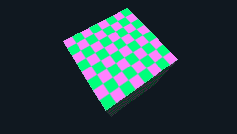
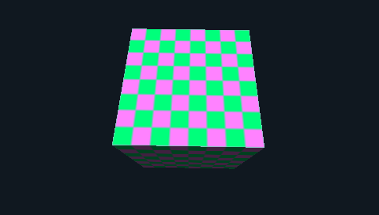

# Nakagawa Recomp

Nakagawa Recomp is an experimental static recompiler that translates user-supplied decrypted PlayStation Portable (PSP) executables into C, links them with a native C runtime, and runs the resulting binary on Windows via SDL3 and Vulkan. Named after the in-game Nakagawa Tennis Club from its flagship test title, *Hot Shots Tennis: Get a Grip*, the project investigates ahead-of-time (AOT) binary translation, low-level hardware fidelity, and high-performance native execution for PSP software.

## What v0.0.1 is, and what it is not

v0.0.1 is the first public build. [`docs/RELEASE_NOTES_v0.0.1.md`](docs/RELEASE_NOTES_v0.0.1.md) is the authoritative release note; this README only summarises the boundary:

**It is** a recompiler that translates **user-supplied unencrypted** PSP executables into C, links them with a native C runtime, and presents the result on Windows through SDL3 and Vulkan; a standalone desktop player (`build/nakagawa_player.exe`) that identifies a disc from its own `PSP_GAME/PARAM.SFO`, builds a runtime package for a title you supply, and launches it; two source-owned showcase demos built from this repository that play in the player with graphics, controller input, sound and savedata; and a fail-closed runtime that stops at a named semantic boundary with a plain message instead of faking success.

**It is not** a game bundle, a decryptor, or one-click play from an ISO:

- **No bundled game.** No game binaries, assets, firmware modules or keys are included, and nothing is downloaded. The showcase demos below are the only game-like programs that ship, and they are project-authored, not commercial titles.
- **No decryption.** Most retail `EBOOT.BIN` and `.prx` files are encrypted; the project ships no decryption tools or keys, and you supply your own unencrypted `EBOOT.elf` and PRXs. Automatic decryption is **in the works** ([#295](https://github.com/Jstar269/nakagawa-recomp/issues/295)).
- **Not one-click from a raw ISO.** The player builds and launches a package for a title you supply, but that still needs the MSYS2 UCRT64 C toolchain on your machine. One-click compile-and-play from a raw ISO without a developer toolchain is **in the works** ([#308](https://github.com/Jstar269/nakagawa-recomp/issues/308)).
- **No second verified title.** A valid disc with no profile imports as **Experimental**; second-title bring-up is **in the works** ([#285](https://github.com/Jstar269/nakagawa-recomp/issues/285)).
- **Windows 11 x64 only.** Linux, macOS and Android player support is **in the works** ([#306](https://github.com/Jstar269/nakagawa-recomp/issues/306), [#329](https://github.com/Jstar269/nakagawa-recomp/issues/329), [#360](https://github.com/Jstar269/nakagawa-recomp/issues/360)).
- **No claim of retail playability.** No commercial PSP game is claimed playable from an ISO alone; see [`ISSUES.md`](ISSUES.md) and [`docs/COMPATIBILITY.md`](docs/COMPATIBILITY.md).

## Run it now: the source-owned showcase demos

The showcase demos are the only game-like programs in this repository: two PSP programs written from source in C against PSPDEV/PSPSDK (`fixtures/showcase/`). They take the ordinary route — analyze the guest ELF, generate portable C, compile, validate, package — and the player discovers them automatically, so you can watch genuinely recompiled PSP code run without owning a disc.

The pictures below are the runtime's own framebuffer snapshots (`SR_FBSNAP=1`, see [`docs/DEBUGGING.md`](docs/DEBUGGING.md)) of those two source-owned showcase demos, recompiled by Nakagawa Recomp, at the native 480×272 PSP framebuffer resolution. They are host-renderer output from this project, not PSP hardware captures and not any commercial title.



*Nakagawa 3D Showcase (`fixtures/showcase/ge_scene`), vblank 120: transformed, textured, depth-tested and lit triangles. The two lower faces turned away from the single directional light are dark. The analog stick rotates the cube, Cross plays a tone.*



*Nakagawa 3D Showcase (`fixtures/showcase/ge_scene`), vblank 240 of the same run: the demo rotates continuously, so consecutive frames differ.*


*Nakagawa Breakout Showcase (`fixtures/showcase/breakout`), vblank 180: flat 2D sprites, a source-owned seven-segment score font, live controller input, sound effects and `sceUtilitySavedata` high-score persistence. The score row is drawn by the demo itself, so it needs no firmware fonts.*

From a checkout, the demos and the player land where the player looks for them, so the library fills itself:

```powershell
mingw32-make player showcase         # build/nakagawa_player.exe + build/demos/{images,packages}
mingw32-make showcase-smoke          # run both demos headlessly with frame/input/audio checks
```

`mingw32-make showcase` needs the PSPDEV/PSPSDK toolchain installed in WSL at `/usr/local/pspdev`; it downloads nothing. [`docs/SHOWCASE.md`](docs/SHOWCASE.md) documents the demos, and their acceptance status under the profile-zero contract is deliberately kept separate from the fact that they build, package and run.

## Goals

The project has three long-term goals, defined in [`docs/PROJECT_MODEL.md`](docs/PROJECT_MODEL.md):

1. **Recompilation:** run *Hot Shots Tennis: Get a Grip* (UCUS-98701) natively through original code generation and a runtime that emulates the PSP at the lowest level that is practical (LLE).
2. **Full decompilation:** reconstruct 100% of the game as source code that compiles back to machine code identical to the retail executable, function by function. Recovered game source is kept private; the public repository carries only the tools and the interoperability facts behind it.
3. **Platform:** turn the work into a general PSP recompilation and decompilation toolkit that does not depend on this one title.

These are targets, not claims about current progress.

## Current status

This repository is an experimental research and compatibility project, **not an end-user release** or a game distribution. It does not include game binaries, proprietary game assets, firmware modules, decryption keys, or private oracle traces.

Public development and automated continuous integration verify the recompiler through source-owned synthetic guests:

- The **differential cosimulation harness** (`mingw32-make cosim-selftest`) verifies semantic parity between AOT-generated code and the fail-closed interpreter floor.
- The **platform ladder** (`mingw32-make platform-ladder`) exercises relocations, scheduler threading, scalar FPU, and filesystem semantics across synthetic workloads.
- The **production smoke fixtures** (`mingw32-make production-smoke`, `mingw32-make display-smoke`) test the complete two-phase build pipeline and display bring-up without proprietary inputs; `mingw32-make display-smoke-player` also launches the fixture through the native player.
- The **source-owned showcase demos** (`mingw32-make showcase showcase-smoke`) are project-authored PSP programs that traverse the whole pipeline into validated packages the player discovers on its own.

The public source boundary deliberately makes no claim of retail title playability. Active development focuses on HLE completeness, timing, scheduler edge cases, and graphics/audio fidelity. Active defect tracking is maintained on [GitHub Issues](https://github.com/Jstar269/nakagawa-recomp/issues); see [`ISSUES.md`](ISSUES.md) for the project status summary.

## Playing a PSP game: what works today

Nakagawa Recomp is an experimental static recompiler, not a finished consumer emulator. No commercial PSP game is currently claimed to be playable out of the box from an ISO image alone ([`ISSUES.md`](ISSUES.md)). However, the project includes a standalone desktop player (`build/nakagawa_player.exe`) designed to eventually deliver a seamless "point at ISO and play" experience ([#308](https://github.com/Jstar269/nakagawa-recomp/issues/308)).

### What you need

- **Operating system:** Windows 11 x64 with a Vulkan-capable graphics card and current GPU drivers.
- **Game image:** A lawfully owned PSP game disc image in uncompressed standard `.iso` format.
- **PSP system fonts (optional but recommended for text):** Authentic in-game typography requires Sony firmware font files (`jpn0.pgf`, `ltn0.pgf`) dumped from a real PSP console (`flash0:/font/`). These proprietary files cannot legally be bundled and must be user-provided; import them into the validated local cache via `python tools/nk_cli.py fonts import <folder>` ([#300](https://github.com/Jstar269/nakagawa-recomp/issues/300)). A clean-room open-font converter is also in the works ([#313](https://github.com/Jstar269/nakagawa-recomp/issues/313)).
- **Expectation:** Adding an ISO identifies the disc and shows a compatibility checklist of what will and will not work. Pressing **BUILD PACKAGE** in the player recompiles the title in front of you, and **Play** starts it once the package validates; for most retail discs you also supply a decrypted executable. Both steps still need the MSYS2 UCRT64 developer toolchain (they compile C on your machine), and one-click play straight from an ISO without it is in the works ([#308](https://github.com/Jstar269/nakagawa-recomp/issues/308)).

### What happens when you add an ISO in the player

1. **Launch the player:** Run `build/nakagawa_player.exe` to open the native desktop interface.
2. **Add your disc image:** Drag and drop an `.iso` file into the player window, or click **Add Game** to select it using the Windows file picker.
3. **Identification:** The player reads the ISO9660 filesystem header and parses `PSP_GAME/PARAM.SFO` directly in C to extract the title and Disc ID, checking it against supported title profiles. Disc identification uses the game's own `PARAM.SFO` for UMD and PS Store images ([#426](https://github.com/Jstar269/nakagawa-recomp/pull/426)), never an update SFO or volume ID. Uncatalogued discs import as experimental titles; second-title verification is in the works ([#285](https://github.com/Jstar269/nakagawa-recomp/issues/285)/[#308](https://github.com/Jstar269/nakagawa-recomp/issues/308)).
4. **Asset inspection and staging:** For supported titles, the player can inspect disc assets and unpack internal game archives (such as `.xb` archives) into a local staging directory.
5. **The recompilation boundary:** Most retail executables (`EBOOT.BIN` and `.prx` modules) are encrypted. When a disc carries an unencrypted `BOOT.BIN`, the player selects it automatically. When an executable is encrypted, the player points the user to a per-title folder (`<player user data>/titles/<DISC_ID>/decrypted/`) for their own decrypted files (`EBOOT.elf` and PRXs) ([#428](https://github.com/Jstar269/nakagawa-recomp/pull/428)), as the project ships no decryption tools or keys ([#295](https://github.com/Jstar269/nakagawa-recomp/issues/295) in the works). [Playing your own games](docs/YOUR_OWN_GAMES.md) explains what the player needs. The player discovers, validates, and launches generated v1 runtime packages from `<player user data>/packages/<DISC_ID>/` ([#297](https://github.com/Jstar269/nakagawa-recomp/issues/297)), and the same build is available on the command line as `python tools/nk_cli.py build-package <disc_id>` ([#296](https://github.com/Jstar269/nakagawa-recomp/issues/296)).
6. **System font import (optional):** For authentic in-game typography, import PGF font files dumped from your own PSP console (`flash0:/font/`) by running `python tools/nk_cli.py fonts import <folder>` ([#300](https://github.com/Jstar269/nakagawa-recomp/issues/300)). The CLI validates each font structurally and stages it into `<player user data>/fonts/v1/`.

### What you will see if something is not supported yet

Nakagawa Recomp strictly follows a **fail-closed** engineering policy: when something is unsupported, missing, or unimplemented, the software halts cleanly at a named semantic boundary and tells you why. It will never fake success, simulate a phantom state, or silently crash:

- **Game not in the built-in list:** A valid PSP disc that has no profile yet is imported as **Experimental**. The card notes that compatibility is unknown, checklist items indicate what is missing, and Play stays unavailable until a matching runtime package exists. Second-title verification is in the works ([#285](https://github.com/Jstar269/nakagawa-recomp/issues/285)) and generic title intake is in the works ([#308](https://github.com/Jstar269/nakagawa-recomp/issues/308)). Images that are not PSP game discs are refused.
- **Encrypted executable:** The checklist reports that the executable is encrypted and directs the user to supply their decrypted modules at `<player user data>/titles/<DISC_ID>/decrypted/` ([#428](https://github.com/Jstar269/nakagawa-recomp/pull/428)), noting that automatic decryption is in the works ([#295](https://github.com/Jstar269/nakagawa-recomp/issues/295)). If an unencrypted `BOOT.BIN` is present on disc or a valid user-supplied `EBOOT.elf` is found in that folder, it is selected automatically.
- **Missing compiled runtime:** If a game has been identified and staged but no matching valid v1 runtime package exists in `<player user data>/packages/<DISC_ID>/`, the preflight checklist reports `RUNTIME_PACKAGE` as missing and the card offers **BUILD PACKAGE**; Play stays disabled until a valid package is built ([#465](https://github.com/Jstar269/nakagawa-recomp/pull/465)). The one exception is a non-experimental catalog title whose developer runtime the launcher resolves, which is playable without a package ([#483](https://github.com/Jstar269/nakagawa-recomp/pull/483)); a stale package shows **REBUILD PACKAGE** and an incompatible one shows `PACKAGE INCOMPATIBLE`.
- **Missing firmware fonts:** If in-game fonts cannot be found, the player notes that the PSP font `jpn0.pgf` is missing and directs you to run `python tools/nk_cli.py fonts import <folder>` ([#300](https://github.com/Jstar269/nakagawa-recomp/issues/300)), rather than substituting mismatched system fonts that cause text clipping. Guest `libfont` startup without a ready-flag bypass is in the works ([#299](https://github.com/Jstar269/nakagawa-recomp/issues/299)), as is the clean-room open-font converter ([#313](https://github.com/Jstar269/nakagawa-recomp/issues/313)).

### Feature status

| Capability | Status | What that means for you | Tracking issue |
| :--- | :--- | :--- | :--- |
| ISO import and identification | Works | Drag-and-drop or the file picker reads the disc's own `PSP_GAME/PARAM.SFO` (title and disc ID) for UMD and PS Store images ([#426](https://github.com/Jstar269/nakagawa-recomp/pull/426)), never using an update SFO or volume ID. Uncatalogued discs import as Experimental. | [#308](https://github.com/Jstar269/nakagawa-recomp/issues/308) |
| Executable decryption | Partially works | Unencrypted `BOOT.BIN` on disc or user-supplied plain `EBOOT.elf` in the per-title decrypted folder ([#428](https://github.com/Jstar269/nakagawa-recomp/pull/428)) is selected automatically. The project ships no decryption; automatic decryption is in the works. | [#295](https://github.com/Jstar269/nakagawa-recomp/issues/295) |
| Recompilation / package build | Partially works | **BUILD PACKAGE** in the player recompiles a library disc ID in front of you with live stage progress and cancel ([#465](https://github.com/Jstar269/nakagawa-recomp/pull/465)); `python tools/nk_cli.py build-package <disc_id>` does the same from a terminal. Packages build with the public runtime backends when the private ones are absent ([#473](https://github.com/Jstar269/nakagawa-recomp/pull/473)), and the build report names every unsupported piece it still lacks, including PGD-protected data ([#295](https://github.com/Jstar269/nakagawa-recomp/issues/295)). | [#295](https://github.com/Jstar269/nakagawa-recomp/issues/295) |
| Runtime package launch | Partially works | The native player discovers, validates, and launches generated v1 runtime packages from the per-user packages directory ([#297](https://github.com/Jstar269/nakagawa-recomp/issues/297)), and for a title you supply in unencrypted form the build-then-Play route runs end to end in the player ([#487](https://github.com/Jstar269/nakagawa-recomp/pull/487)). Automated one-click compile-and-launch directly from a raw ISO, without the developer toolchain, is in the works. | [#308](https://github.com/Jstar269/nakagawa-recomp/issues/308) |
| Multi-title support | In the works | Uncatalogued discs import as experimental titles with fail-closed checklists. Multi-title platform bring-up with zero generic-core title patches is in progress. | [#285](https://github.com/Jstar269/nakagawa-recomp/issues/285), [#308](https://github.com/Jstar269/nakagawa-recomp/issues/308) |
| Source-owned showcase demos | Works, acceptance in the works | Two project-authored PSPDEV demos (a lit, textured 3D scene and Breakout with input, sound and savedata) are built from source into deterministic plaintext images and validated packages, and the player discovers them automatically as **Showcase demo** cards ([#477](https://github.com/Jstar269/nakagawa-recomp/pull/477)). Their profile-zero acceptance evidence is still being recorded. | [#309](https://github.com/Jstar269/nakagawa-recomp/issues/309) |
| System fonts | Partially works | Authentic typography requires user-provided Sony PSP firmware PGF fonts (`jpn0.pgf`, `ltn0.pgf`). Import with `python tools/nk_cli.py fonts import <folder>` into the validated local cache (`fonts/v1`); public builds render them through the project-authored PGF reader ([#474](https://github.com/Jstar269/nakagawa-recomp/pull/474)). Guest `libfont` startup without a ready-flag bypass and the clean-room open-font converter are in the works. | [#299](https://github.com/Jstar269/nakagawa-recomp/issues/299), [#313](https://github.com/Jstar269/nakagawa-recomp/issues/313) |
| Audio output | Works | Public builds play sound through your default audio device (SDL3). Without a device the game keeps running silently. | [#301](https://github.com/Jstar269/nakagawa-recomp/issues/301) |
| Graphics | Partially works | SDL3 and Vulkan hardware rendering (with software rasterizer fallback) present frames and in-game scenes, but known visual defects exist (e.g. transient model corruption) and independent GE work is ongoing. | [#69](https://github.com/Jstar269/nakagawa-recomp/issues/69), [#353](https://github.com/Jstar269/nakagawa-recomp/issues/353) |
| FMV / video | Partially works | Host-HLE PSMF video playback (MPEG-4 AVC / H.264 via Media Foundation and standalone decoders) plays cutscenes in tested titles, but native guest PRX execution and a portable video backend remain in progress. | [#283](https://github.com/Jstar269/nakagawa-recomp/issues/283), [#279](https://github.com/Jstar269/nakagawa-recomp/issues/279) ([#286](https://github.com/Jstar269/nakagawa-recomp/issues/286)) |
| Save data | Partially works | `sceUtilitySavedata` writes and reads save files in a local memory-stick folder, and ordinary `ms0:` file I/O and savedata now share one Memory Stick namespace ([#334](https://github.com/Jstar269/nakagawa-recomp/issues/334)). Replacing the inherited savedata behavior with a project-authored host-filesystem implementation is in the works. | [#350](https://github.com/Jstar269/nakagawa-recomp/issues/350) |
| Controller input / remapping | Partially works | SDL3 detects connected gamepads and navigates the player library with a fixed default mapping. The player's Controller Settings screen provides in-app remapping of the 14 digital PSP controls and the analog stick, deadzone and trigger calibration, and a live input monitor ([#455](https://github.com/Jstar269/nakagawa-recomp/pull/455), [#465](https://github.com/Jstar269/nakagawa-recomp/pull/465)), and the running game window applies the saved host input profile ([#437](https://github.com/Jstar269/nakagawa-recomp/pull/437)). Per-title input profiles are not implemented and have no open tracking issue yet. | — |
| Linux / macOS / Android | In the works | Only Windows 11 x64 is supported today. Linux is the first planned non-Windows platform once host seams are portable, followed by macOS (Apple Silicon) and Android ARM64. | [#306](https://github.com/Jstar269/nakagawa-recomp/issues/306), [#329](https://github.com/Jstar269/nakagawa-recomp/issues/329), [#360](https://github.com/Jstar269/nakagawa-recomp/issues/360) |

See [`docs/COMPATIBILITY.md`](docs/COMPATIBILITY.md) for the per-title and subsystem compatibility breakdown with tracking issues, and [`docs/SMOKE_TEST.md`](docs/SMOKE_TEST.md) for the release smoke test.

## Developer quick start

### Prerequisites

- Windows 11 x64 with PowerShell 7.4+ (`pwsh`)
- CPython 3.14.x
- MSYS2 UCRT64 toolchain (GCC/G++, GNU Make, SDL3, Vulkan headers & loader)
- A current Vulkan SDK and a Vulkan-capable GPU

Install the MSYS2 packages from a UCRT64 terminal:

```bash
pacman -S --needed mingw-w64-ucrt-x86_64-gcc mingw-w64-ucrt-x86_64-make mingw-w64-ucrt-x86_64-sdl3 mingw-w64-ucrt-x86_64-vulkan-headers mingw-w64-ucrt-x86_64-vulkan-loader
```

### Build public synthetic smoke routes

Verify the toolchain and pipeline without proprietary game inputs. Run these from a shell whose `PATH` includes the MSYS2 UCRT64 tools: a UCRT64 terminal, or PowerShell after `$env:Path = "C:\msys64\ucrt64\bin;$env:Path"`.

```powershell
.\nk_manager.ps1 -Action Test                 # selftest gate (make selftest)
python -m unittest discover -s tools -p "test_*.py"  # Python tooling suite
mingw32-make player                          # build/nakagawa_player.exe, the native player
mingw32-make production-smoke                 # Two-phase pipeline smoke test
mingw32-make platform-ladder                  # Multi-workload synthetic platform ladder
mingw32-make cosim-selftest                   # Differential AOT vs. interpreter cosimulation
```

### Local game inputs

To build with a lawfully obtained copy of *Hot Shots Tennis: Get a Grip*, place private inputs into the Git-ignored `place_game_here/` layout below. This layout, including the named middleware PRXs and the `xbdata_extracted` tree, is specific to the HST route; other titles take their filesystem and module paths from their own title manifest.

```text
place_game_here/
├── EBOOT.elf                     # Decrypted game executable
├── ISO/<game>.iso                # Lawfully obtained game ISO
└── EXTRACTED/
    ├── decrypted/                # Decrypted PRXs (libfont.prx, scePsmf_library.prx, scePsmfP_library.prx)
    └── PSP_GAME/
        ├── SYSDIR/EBOOT.BIN      # PSP header/BSS metadata
        └── USRDIR/xbdata_extracted/ # Extracted game data (via python tools/extract_xb.py)
```

Building a retail title requires a local title manifest (for HST: `assets/titles/hst-ucus98701.json`, which is intentionally never checked in and publication-excluded):

```powershell
.\nk_manager.ps1 -Action BuildFull -TitleManifest assets/titles/hst-ucus98701.json -GameName hst
.\nk_manager.ps1 -Action Run -TitleManifest assets/titles/hst-ucus98701.json -GameName hst
```

See [`docs/SETUP.md`](docs/SETUP.md) for authoritative toolchain details, input layout requirements, and troubleshooting.

## How it works

The build system operates in two phases:

1. **Offline translation:** Host-side Python tools analyze the decrypted ELF/PRX (`tools/prxload.py`, `tools/analyze.py`), resolve import NIDs to native HLE functions (`tools/imports.py`), and translate MIPS machine code into chunks of portable C (`tools/codegen.py`).
2. **Native compilation:** GNU Make and GCC compile the generated C translation units alongside the native runtime (`src/rt/`), which provides guest memory management, cooperative thread scheduling, HLE syscall emulation, an AOT-gap interpreter fallback floor, audio decoding, and an SDL3 + Vulkan hardware renderer (`src/rt/gpu_sdl3vk/`).

See [`docs/ARCHITECTURE.md`](docs/ARCHITECTURE.md) for subsystem structure, execution models, and data-flow diagrams.

## Project direction

Nakagawa Recomp's long-term goal is to evolve into a definitive, multi-title PSP recompilation and preservation platform built from original code wherever possible.

While initial development began by adapting upstream open-source toolkits, the architectural direction systematically replaces convenience shortcuts and high-level approximations with maximal sensible low-level emulation (LLE), precise hardware-measured semantics, and original implementations. Core initiatives include:

- Driving title-specific HLE overrides toward zero in generic runtime code
- Prioritizing guest execution fidelity over host reimplementations
- Expanding data-driven multi-title manifest planning
- Delivering and hardening the standalone native player interface

See [`docs/LLE_FIDELITY_ARCHITECTURE.md`](docs/LLE_FIDELITY_ARCHITECTURE.md) and [`docs/PROJECT_MODEL.md`](docs/PROJECT_MODEL.md) for the project's engineering principles.

## Legal and lineage summary

- **Project license declaration:** The repository-level project declaration is **GPL-3.0-or-later** ([LICENSE](LICENSE)). Many source files and inherited components retain GPL-2.0-or-later or upstream-specific terms; this declaration does not establish that every combined distribution configuration is legally cleared.
- **Open licensing questions:** Inherited PGF/font and PGD/amctrl questions remain under explicit review; the affected components are excluded from the public source profile. See [NOTICE.md](NOTICE.md) and [docs/PUBLICATION_READINESS.md](docs/PUBLICATION_READINESS.md).
- **Lineage and upstreams:** The project began as a fork of [sal063's PSP Recompilation Project](https://github.com/sal063/PSP-recompilation-project) (GPL-2.0-or-later) and retains substantial modified code from that lineage. Portions of the HLE, GE, and VFPU subsystems adapt or derive from [PPSSPP](https://github.com/hrydgard/ppsspp) (GPL-2.0-or-later). See [CREDITS.md](CREDITS.md), [NOTICE.md](NOTICE.md), and [assets/public_provenance_ledger.json](assets/public_provenance_ledger.json).
- **"Independent" disclaimer:** Nakagawa Recomp is an independent research and compatibility project. "Independent" describes its relationship to Sony Interactive Entertainment, Clap Hanz, and game rights-holders; it does not mean the recompiler codebase is clean-room or independently originated. Nakagawa Recomp is not affiliated with, authorized by, or endorsed by Sony Interactive Entertainment, Clap Hanz, PPSSPP, sal063, or other upstream authors.
- **No proprietary content:** This repository does not distribute game executables, assets, firmware modules, decryption keys, or private oracle traces. Users must supply their own lawfully obtained game files.
- **Publication controls:** `Jstar269/nakagawa-recomp` is the active sanitized public source repository. Its history begins with the sanitized restoration lineage; former development history is not ordinary `main` ancestry and must not be reconnected. Publication gates, source profiles ([`assets/public_source_profile.json`](assets/public_source_profile.json)), and provenance audits are engineering controls, not legal clearance.

## Contributing

Contributions are welcome. Before submitting changes, review:

- [`CONTRIBUTING.md`](CONTRIBUTING.md) — contribution workflow, coding standards, and verification expectations
- [`CODE_OF_CONDUCT.md`](CODE_OF_CONDUCT.md) — community standards and pledge
- [`SECURITY.md`](SECURITY.md) — vulnerability reporting and security scope
- [`docs/DCO_POLICY.md`](docs/DCO_POLICY.md) — Developer Certificate of Origin (DCO 1.1) sign-off policy (`git commit -s`)
- [`docs/AI_USAGE.md`](docs/AI_USAGE.md) — boundaries and disclosures for AI-assisted development
- [`CREDITS.md`](CREDITS.md) — upstream attribution and project lineage

## Dedication

Nakagawa Recomp is part of **Project Blitzen**, a broader long-term effort dedicated to Blitzen, my German Shepherd and companion for 13½ years. The best dog you could ever have.

Blitzen's loyalty, strength, and constant presence are remembered through the patience, care, and persistence behind this work.

The name **Nakagawa Recomp** remains the technical identity of this repository. **Project Blitzen** is intended as an umbrella name for this project and possible future PSP recompilation, decompilation, compatibility, and preservation-research work.

This dedication is personal. It does not imply affiliation with any other project, organization, product, or prior use of the name “Project Blitzen.”
