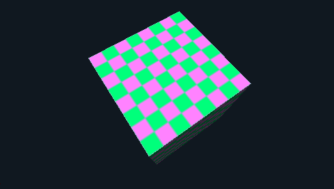
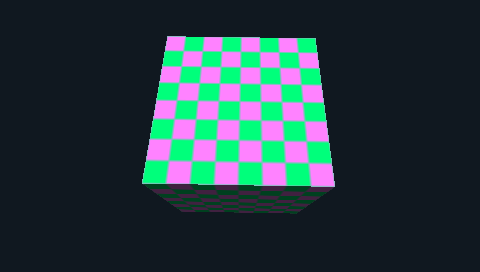

# Nakagawa Recomp

Nakagawa Recomp is an experimental static recompiler that translates user-supplied PlayStation Portable (PSP) executables into C, links them with a native C runtime, and runs the resulting binary on Windows via SDL3 and Vulkan. For supported encrypted executables, the player can decrypt from a user's matching local key file before compilation. Named after the in-game Nakagawa Tennis Club from its flagship test title, *Hot Shots Tennis: Get a Grip*, the project investigates ahead-of-time (AOT) binary translation, low-level hardware fidelity, and high-performance native execution for PSP software.

## What v0.0.1 is, and what it is not

v0.0.1 is the first public build. [`docs/RELEASE_NOTES_v0.0.1.md`](docs/RELEASE_NOTES_v0.0.1.md) is the authoritative release note; this README only summarises the boundary:

**It is** a recompiler that translates user-supplied PSP executables into C, links them with a native C runtime, and presents the result on Windows through SDL3 and Vulkan; a standalone desktop player (`build/nakagawa_player.exe`) that identifies a disc from its own `PSP_GAME/PARAM.SFO`, builds a runtime package for a title you supply, and launches it; two source-owned showcase demos built from this repository that play in the player with graphics, controller input, sound and savedata; and a fail-closed runtime that stops at a named semantic boundary with a plain message instead of faking success.

**It is not** a game bundle or one-click play from any raw ISO:

- **No bundled game.** No game binaries, assets, firmware modules or keys are included, and no game data is downloaded. With your consent, the prerequisite fetcher downloads only the build tools declared in the package manifest. The showcase demos below are the only game-like programs that ship, and they are project-authored, not commercial titles.
- **Decryption uses your own key file.** Most retail `EBOOT.BIN` and `.prx` files are encrypted. The player and `nk_cli` include a built-in decryption boundary that unwraps the disc's `EBOOT.BIN` and its encrypted `.prx` modules when you supply your own local key file, writing them into the private per-title folder (`<player user data>/titles/<DISC_ID>/decrypted/`) under their disc file names; the project ships no keys. Each module fails closed on its own, so a module whose key entry your file lacks is named exactly and still has to be supplied unencrypted ([#548](https://github.com/Jstar269/nakagawa-recomp/pull/548), [#550](https://github.com/Jstar269/nakagawa-recomp/pull/550)).
- **Package prerequisites need your consent.** On a clean PATH, **BUILD PACKAGE** offers one consent to download and verify the pinned build prerequisites from their declared official hosts. You can install the toolchain yourself instead. A supported title profile is still required; generic ISO-to-Play coverage and additional title candidates are **in the works** ([#308](https://github.com/Jstar269/nakagawa-recomp/issues/308)).
- **Second-title compatibility stops at a demonstrated stage.** PAC-MAN Championship Edition reaches its menu and plays a stage through generic fixes without title-specific branches ([#552](https://github.com/Jstar269/nakagawa-recomp/pull/552), [#556](https://github.com/Jstar269/nakagawa-recomp/pull/556)). Complete-game compatibility and additional title candidates are **in the works** ([#308](https://github.com/Jstar269/nakagawa-recomp/issues/308)).
- **Windows 11 x64 only.** Linux, macOS and Android player support is **in the works** ([#306](https://github.com/Jstar269/nakagawa-recomp/issues/306), [#329](https://github.com/Jstar269/nakagawa-recomp/issues/329), [#360](https://github.com/Jstar269/nakagawa-recomp/issues/360)).
- **No complete commercial-game compatibility claim.** PAC-MAN CE reaches a playable stage, but no complete commercial-game playthrough from an ISO is claimed. See [`ISSUES.md`](ISSUES.md) and [`docs/COMPATIBILITY.md`](docs/COMPATIBILITY.md).

### Launch the v0.0.1 Windows package

Unpack the complete archive and launch `bin\nakagawa_player.exe` beside its packaged SDL3 runtime DLLs. The Windows graphics driver or a Vulkan runtime must provide `vulkan-1.dll`. The archive contains no game image, firmware files, or keys. On **BUILD PACKAGE**, a clean PATH prompts once before downloading pinned prerequisites from their declared official hosts; you may also install Python, Make, and the MSYS2 UCRT64 compiler yourself. Supported encrypted executables need a matching local key, or supply the decrypted files yourself ([#548](https://github.com/Jstar269/nakagawa-recomp/pull/548), [#550](https://github.com/Jstar269/nakagawa-recomp/pull/550)). The release archive's developer commands run from its `source/` directory. Broader generic ISO-to-Play coverage is in the works ([#308](https://github.com/Jstar269/nakagawa-recomp/issues/308)).

## Run it now: the source-owned showcase demos

The showcase demos are the only game-like programs in this repository: two PSP programs written from source in C against PSPDEV/PSPSDK (`fixtures/showcase/`). They take the ordinary route — analyze the guest ELF, generate portable C, compile, validate, package — and the player discovers them automatically, so you can watch genuinely recompiled PSP code run without owning a disc.

The pictures below are the runtime's own framebuffer snapshots (`SR_FBSNAP=1`, see [`docs/DEBUGGING.md`](docs/DEBUGGING.md)) of those two source-owned showcase demos, recompiled by Nakagawa Recomp, at the native 480×272 PSP framebuffer resolution. They are host-renderer output from this project, not PSP hardware captures and not any commercial title.



*Nakagawa 3D Showcase (`fixtures/showcase/ge_scene`), vblank 120: transformed, textured, depth-tested and lit triangles. The two lower faces turned away from the single directional light are dark. The analog stick rotates the cube, Cross plays a tone.*



*Nakagawa 3D Showcase (`fixtures/showcase/ge_scene`), vblank 240 of the same run: the demo rotates continuously, so consecutive frames differ.*


*Nakagawa Breakout Showcase (`fixtures/showcase/breakout`), vblank 180: flat 2D sprites, a source-owned seven-segment score font, live controller input, sound effects and `sceUtilitySavedata` high-score persistence. The score row is drawn by the demo itself, so it needs no firmware fonts.*

From a checkout, the demos and the player land where the player looks for them, so the library fills itself:

```powershell
mingw32-make player showcase         # build/nakagawa_player.exe + build/demos/{images,packages}
mingw32-make showcase-smoke          # run both demos headlessly with frame/input/audio checks
```

`mingw32-make showcase` needs the PSPDEV/PSPSDK toolchain installed in WSL at `/usr/local/pspdev`; it downloads nothing. [`docs/SHOWCASE.md`](docs/SHOWCASE.md) documents the demos, and their acceptance status under the profile-zero contract is deliberately kept separate from the fact that they build, package and run.

## Play your own game

What you need:

- **Windows 11 x64** with a Vulkan-capable graphics card and current GPU drivers.
- **A lawfully owned PSP game disc image** in uncompressed standard `.iso` format. No game data is downloaded for you.
- **A supported game executable**, for most commercial games — the built-in decryption boundary handles supported encrypted executables with your own matching local key file; otherwise provide your own plain files (see step 3). PGD-protected content is still unsupported and is in the works ([#308](https://github.com/Jstar269/nakagawa-recomp/issues/308)).
- **PSP system fonts (optional but recommended for text):** authentic in-game typography uses Sony firmware font files (`jpn0.pgf`, `ltn0.pgf`) dumped from a real PSP console. They cannot legally be bundled and must be user-provided ([#300](https://github.com/Jstar269/nakagawa-recomp/issues/300)).

Then, in the player:

1. **Launch the player.** Run `build/nakagawa_player.exe` (or `bin\nakagawa_player.exe` from the release package) to open the native desktop interface.
2. **Add your disc image.** Drag and drop an `.iso` into the player window; from an empty library, press `O` or choose **START SETUP WIZARD**, and from a populated library choose **ADD ANOTHER ISO**. The player reads the disc's own `PSP_GAME/PARAM.SFO` directly for the title and Disc ID, never an update SFO or a volume ID ([#426](https://github.com/Jstar269/nakagawa-recomp/pull/426)). It checks the image against supported title profiles, and uncatalogued discs import as **Experimental** ([#308](https://github.com/Jstar269/nakagawa-recomp/issues/308)). For supported titles the player can also inspect disc assets and unpack internal game archives (such as `.xb` archives) into a local staging directory.
3. **Supply an unencrypted executable if asked.** A disc that carries an unencrypted `BOOT.BIN` is selected automatically. Otherwise the player decrypts supported `EBOOT.BIN` and `.prx` files through its built-in boundary when you have supplied a matching local key file, and points you to the per-title folder (`<player user data>/titles/<DISC_ID>/decrypted/`) for your own plain `EBOOT.elf` and modules ([#428](https://github.com/Jstar269/nakagawa-recomp/pull/428), [#548](https://github.com/Jstar269/nakagawa-recomp/pull/548), [#550](https://github.com/Jstar269/nakagawa-recomp/pull/550)). [`docs/YOUR_OWN_GAMES.md`](docs/YOUR_OWN_GAMES.md) explains exactly what goes where.
4. **Build the package.** Press **BUILD PACKAGE** to recompile the title in front of you with live stage progress; **Play** starts it once the package validates ([#465](https://github.com/Jstar269/nakagawa-recomp/pull/465)). On a clean PATH, consent once to install pinned prerequisites from their declared official hosts; or install Python, Make, and the MSYS2 UCRT64 toolchain yourself ([#547](https://github.com/Jstar269/nakagawa-recomp/pull/547)). The same build runs from a terminal as `python tools/nk_cli.py build-package <disc_id>` ([#296](https://github.com/Jstar269/nakagawa-recomp/issues/296)); the player discovers, validates, and launches generated packages from `<player user data>/packages/<DISC_ID>/` ([#297](https://github.com/Jstar269/nakagawa-recomp/issues/297)).
5. **Import system fonts (optional).** For authentic in-game typography, run `python tools/nk_cli.py fonts import <folder>` on the fonts dumped from your own console ([#300](https://github.com/Jstar269/nakagawa-recomp/issues/300)). A project-authored open-font converter is in the works ([#313](https://github.com/Jstar269/nakagawa-recomp/issues/313)).
6. **Play, or read the boundary.** Anything the software cannot handle yet stops at a named semantic boundary with a message that says why — it never fakes success. [`docs/YOUR_OWN_GAMES.md`](docs/YOUR_OWN_GAMES.md) lists what you will see, and [`docs/COMPATIBILITY.md`](docs/COMPATIBILITY.md) gives the per-title and subsystem breakdown with tracking issues; [`docs/SMOKE_TEST.md`](docs/SMOKE_TEST.md) is the release smoke test.

## Where status lives

- **[GitHub Issues](https://github.com/Jstar269/nakagawa-recomp/issues)** — the live authority for what is open, what is fixed, and what is next. [`ISSUES.md`](ISSUES.md) is the project status summary.
- **[`docs/COMPATIBILITY.md`](docs/COMPATIBILITY.md)** — per-title and subsystem compatibility states, named semantic boundaries, and tracking issues.
- **[`docs/RELEASE_NOTES_v0.0.1.md`](docs/RELEASE_NOTES_v0.0.1.md)** — what the first public build does and does not do.
- **[`docs/README.md`](docs/README.md)** — the documentation index, with a row for every maintained document.

Public development is verified through source-owned synthetic guests rather than retail titles: a differential cosimulation harness (`mingw32-make cosim-selftest`) checks AOT code against the fail-closed interpreter floor, a platform ladder (`mingw32-make platform-ladder`) exercises relocations, scheduler threading, scalar FPU and filesystem semantics, production and display smoke fixtures (`mingw32-make production-smoke`, `mingw32-make display-smoke`) run the whole two-phase pipeline without proprietary inputs, and the showcase demos (`mingw32-make showcase showcase-smoke`) traverse the pipeline into packages the player discovers on its own. Active development focuses on HLE completeness, timing, scheduler edge cases, and graphics/audio fidelity. The routes are listed with their commands in [`docs/SETUP.md`](docs/SETUP.md); hosted behaviour is defined by [`docs/CI.md`](docs/CI.md).

## Goals

The project has three long-term goals, defined in [`docs/PROJECT_MODEL.md`](docs/PROJECT_MODEL.md):

1. **Recompilation:** run *Hot Shots Tennis: Get a Grip* (UCUS-98701) natively through original code generation and a runtime that emulates the PSP at the lowest level that is practical (LLE).
2. **Full decompilation:** reconstruct 100% of the game as source code that compiles back to machine code identical to the retail executable, function by function. Recovered game source is kept private; the public repository carries only the tools and the interoperability facts behind it.
3. **Platform:** turn the work into a general PSP recompilation and decompilation toolkit that does not depend on this one title.

These are targets, not claims about current progress. The engineering direction that serves them is recorded in [`docs/PROJECT_MODEL.md`](docs/PROJECT_MODEL.md).

## How it works

The build system operates in two phases: host-side Python tools analyze the decrypted ELF/PRX, resolve import NIDs to native HLE functions, and translate MIPS machine code into chunks of portable C; then GNU Make and GCC compile that generated C together with the native runtime, which provides guest memory management, cooperative thread scheduling, HLE syscall emulation, an AOT-gap interpreter fallback floor, audio decoding, and an SDL3 + Vulkan hardware renderer.

[`docs/ARCHITECTURE.md`](docs/ARCHITECTURE.md) is the subsystem map: execution models, directory layout, data flow, and where to look when something breaks.

## Legal and lineage summary

- **Project license declaration:** the repository-level project declaration is **GPL-3.0-or-later** ([LICENSE](LICENSE)). Many source files and inherited components retain GPL-2.0-or-later or upstream-specific terms; this declaration does not establish that every combined distribution configuration is legally cleared.
- **Open licensing questions:** inherited PGF/font and PGD/amctrl questions remain under explicit review; the affected components are excluded from the public source profile. See [NOTICE.md](NOTICE.md) and [docs/PUBLICATION_READINESS.md](docs/PUBLICATION_READINESS.md).
- **Lineage and upstreams:** the project began as a fork of [sal063's PSP Recompilation Project](https://github.com/sal063/PSP-recompilation-project) (GPL-2.0-or-later) and retains substantial modified code from that lineage. Portions of the HLE, GE, and VFPU subsystems adapt or derive from [PPSSPP](https://github.com/hrydgard/ppsspp) (GPL-2.0-or-later). See [CREDITS.md](CREDITS.md), [NOTICE.md](NOTICE.md), and [assets/public_provenance_ledger.json](assets/public_provenance_ledger.json).
- **"Independent" disclaimer:** Nakagawa Recomp is an independent research and compatibility project. "Independent" describes its relationship to Sony Interactive Entertainment, Clap Hanz, and game rights-holders; it does not mean the recompiler codebase is clean-room or independently originated. Nakagawa Recomp is not affiliated with, authorized by, or endorsed by Sony Interactive Entertainment, Clap Hanz, PPSSPP, sal063, or other upstream authors.
- **No proprietary content:** this repository does not distribute game executables, assets, firmware modules, decryption keys, or private oracle traces. Users must supply their own lawfully obtained game files.
- **Publication controls:** `Jstar269/nakagawa-recomp` is the active sanitized public source repository. Its history begins with the sanitized restoration lineage; former development history is not ordinary `main` ancestry and must not be reconnected. Publication gates, source profiles ([`assets/public_source_profile.json`](assets/public_source_profile.json)), and provenance audits are engineering controls, not legal clearance.

## Contributing

Contributions are welcome. Before submitting changes, review:

- [`CONTRIBUTING.md`](CONTRIBUTING.md) — contribution workflow, coding standards, verification expectations, and the fast `contrib-check` path
- [`docs/SETUP.md`](docs/SETUP.md) — toolchain installation (Windows 11 x64, PowerShell 7.4+, CPython 3.14.x, MSYS2 UCRT64) and the build/test commands
- [`CODE_OF_CONDUCT.md`](CODE_OF_CONDUCT.md) — community standards and pledge
- [`SECURITY.md`](SECURITY.md) — vulnerability reporting and security scope
- [`docs/DCO_POLICY.md`](docs/DCO_POLICY.md) — Developer Certificate of Origin (DCO 1.1) sign-off policy (`git commit -s`)
- [`docs/AI_USAGE.md`](docs/AI_USAGE.md) — boundaries and disclosures for AI-assisted development
- [`CREDITS.md`](CREDITS.md) — upstream attribution and project lineage

## Dedication

Nakagawa Recomp is part of **Project Blitzen**, a broader long-term effort dedicated to Blitzen, my German Shepherd and companion for 13½ years. The best dog you could ever have.

Blitzen's loyalty, strength, and constant presence are remembered through the patience, care, and persistence behind this work.

The name **Nakagawa Recomp** remains the technical identity of this repository. **Project Blitzen** is intended as an umbrella name for this project and possible future PSP recompilation, decompilation, compatibility, and preservation-research work.

This dedication is personal. It does not imply affiliation with any other project, organization, product, or prior use of the name “Project Blitzen.”
