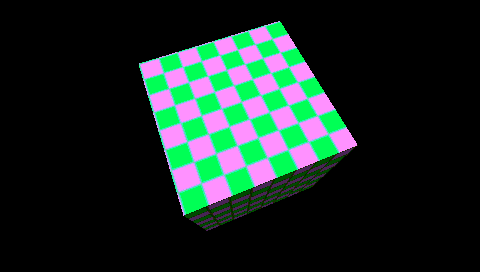
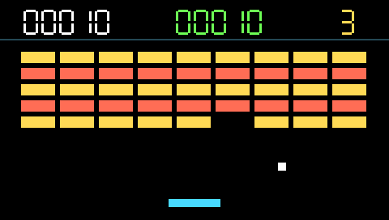
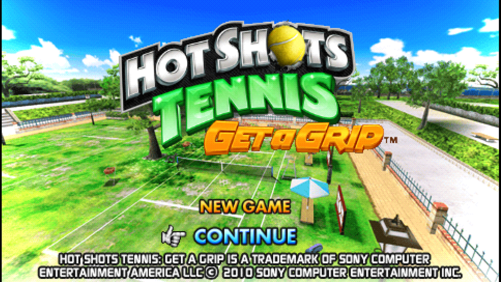

<!-- markdownlint-disable-file MD041 -- the centred header starts with a div -->

<picture>
  <source media="(prefers-color-scheme: dark)" srcset="docs/images/brand/nakagawa-mark-dark.svg">
  
</picture>

# Nakagawa Recomp

**Your PSP games, recompiled into native Windows programs.**

Part of the Nakagawa family, with [hst-decomp](https://github.com/Jstar269/hst-decomp), the matching decompilation of Hot Shots Tennis: Get a Grip.

|  |  |
| :---: | :---: |
| **3D Showcase** | **Breakout Showcase** |

Two project-written PSP programs, recompiled and running at the PSP's native 480×272. No commercial game is shown in these two demos, and none is included.

## Screenshots

|  |
| :---: |
| **Title screen** |

Hot Shots Tennis: Get a Grip belongs to its publisher. This repository contains no game data: you need your own copy of the game, and nothing here downloads one.

## Why it's different

- **Native, not emulated.** The game's MIPS code is translated ahead of time into C and compiled into a real Windows
  program. A native runtime supplies the PSP's system services, audio and an SDL3 + Vulkan renderer.
- **Honest by design.** When something isn't supported yet, it stops at a named boundary with a plain message. It
  never fakes success.
- **Bring your own game.** No games, firmware, keys or Sony fonts ship here, and no game data is ever downloaded.
- **Offline by default.** Nakagawa connects to the internet only when you agree, and today only to fetch build
  tools ([network use](docs/SETUP.md#network-use)).

## Quick start

New to this? The [prerequisites](docs/SETUP.md#prerequisites) are one list in [`docs/SETUP.md`](docs/SETUP.md).

1. **Build the player** from a checkout: `mingw32-make player` (Windows 11 x64 with a Vulkan GPU, PowerShell 7.4+ and
   MSYS2 UCRT64).
2. **Add a game you own.** Start `build\nakagawa_player.exe`, then drag its `.iso` into the player window, or choose
   **START SETUP WIZARD** (later **ADD ANOTHER ISO**).
3. **Unlock it with your own key file.** Supported encrypted executables are decrypted locally
   ([#548](https://github.com/Jstar269/nakagawa-recomp/pull/548), [#550](https://github.com/Jstar269/nakagawa-recomp/pull/550));
   [`docs/YOUR_OWN_GAMES.md`](docs/YOUR_OWN_GAMES.md) shows what goes where.
4. **Press BUILD PACKAGE, then Play.** On a clean PATH, consent once and the player fetches its pinned build tools.
5. **Optional:** text uses the project's own open fonts ([#313](https://github.com/Jstar269/nakagawa-recomp/issues/313));
   for the PSP's original typography, import the fonts from your own PSP with
   `python tools/nk_cli.py fonts import <folder>`.

No game at hand? `mingw32-make player showcase` (on Windows it needs WSL 2 and PSPDEV: [steps](docs/SETUP.md#showcase-demos-on-windows-wsl-2-and-pspdev)) builds the two demos above, and the player finds them on its own.

## Status

| | |
| --- | --- |
| Flagship title | *Hot Shots Tennis: Get a Grip*, the game the project is built around |
| Second title | PAC-MAN Championship Edition plays a stage through generic fixes ([#556](https://github.com/Jstar269/nakagawa-recomp/pull/556)) |
| More titles | In the works ([#308](https://github.com/Jstar269/nakagawa-recomp/issues/308)); per-title detail in [`docs/COMPATIBILITY.md`](docs/COMPATIBILITY.md) |
| Long-term goals | Native play, a byte-matching decompilation, and a general PSP toolkit ([`docs/PROJECT_MODEL.md`](docs/PROJECT_MODEL.md)) |

## Learn more

[How it works](docs/ARCHITECTURE.md#pipeline) · [All documentation](docs/README.md) · [Open issues](https://github.com/Jstar269/nakagawa-recomp/issues) ·
[Contributing](CONTRIBUTING.md) · [Security](SECURITY.md) · [Code of conduct](CODE_OF_CONDUCT.md)

## License and lineage

GPL-3.0-or-later ([LICENSE](LICENSE)); some files keep GPL-2.0-or-later or their upstream terms. The project began as
a fork of [sal063's PSP Recompilation Project](https://github.com/sal063/PSP-recompilation-project) and still contains
code from it and code adapted from [PPSSPP](https://github.com/hrydgard/ppsspp); the ATRAC audio decoders come from
FFmpeg. It is not affiliated with or endorsed by Sony Interactive Entertainment, Clap Hanz, or those upstream authors.
Details: [NOTICE.md](NOTICE.md) and [CREDITS.md](CREDITS.md).

## Dedication

Dedicated to Blitzen: One of the greatest pets you could ever have. A companion from beginning to end.

An absolute sweetheart.

2012-2026
