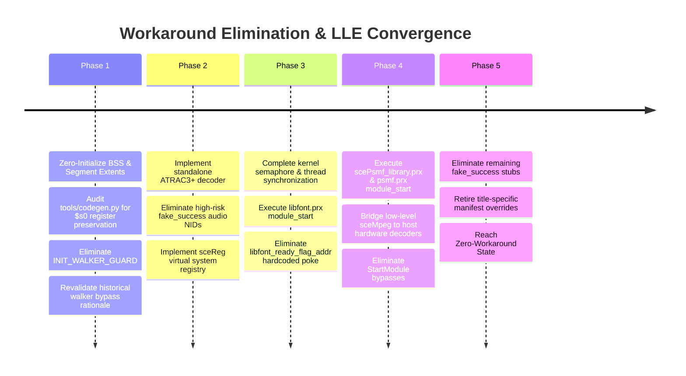

# HLE and Workaround Inventory: System Classification & Migration Plan

## 1. The HLE Budget Doctrine

In accordance with the authentic guest execution doctrine, Nakagawa Recomp tracks and budgets all emulation components across five distinct tiers:

| Tier | Classification | Description | Architectural Objective |
| :--- | :--- | :--- | :--- |
| **Tier 1** | `ORIGINAL_GUEST_EXECUTION` | Compiled MIPS machine code from retail executables and vendor PRX modules executing directly via AOT C chunks or fail-closed interpreter. | **MAXIMIZE** (Target: $\ge 90\%$ of all executed instructions) |
| **Tier 2** | `LLE_RUNTIME` | Low-level hardware virtualization services: register state preservation, MIPS ABI compliance, dynamic dispatch latching, and CPU exception/memory mapping. | **EXPAND & HARDEN** |
| **Tier 3** | `GENERIC_HLE` | Platform OS/kernel abstractions that inherently bridge to the host: thread scheduling, synchronization primitives, Vulkan GE command submission, audio streams, and raw block I/O. | **MAINTAIN STRICTLY GENERIC** |
| **Tier 4** | `TITLE_SPECIFIC_HLE` | Functions or hooks that special-case a specific game title, write hardcoded flags to guest memory, or short-circuit guest execution loops. | **ELIMINATE $\to 0$** |
| **Tier 5** | `PATCH/WORKAROUND` | Fake-success stubs (returning 0 without implementing semantics), loop iteration caps, register clobber guards, and bypasses. | **ELIMINATE $\to 0$** |

### The Cardinal Rule of Lower Layers

For every existing or proposed HLE routine, developers and agents must answer:
> **"Why can this behavior not instead be implemented one layer lower?"**

---

## 2. Quantitative Census of the Current Codebase

Import counts below come from the generated HLE manifest on this worktree. The
hook-table, title-configuration, and walker line references remain the census
recorded at `8e58c6b`.
Run `tools/test_compat_manifest.py` for the current compatibility inventory gate:

```text
================================================================================
NAKAGAWA SUBSYSTEM CENSUS
================================================================================
Import Registrations Audited (generated HLE manifest): 404 NIDs
  - Dedicated Implementations:                       383 NIDs (Tier 3 Generic HLE)
  - Fake Success Exceptions:                            3 NIDs (named compatibility routes)
  - Controlled Unsupported:                           18 NIDs (Fail-closed)

Dispatch Hooks & Walkers (src/rt/recomp.c):
  - Exact-Match Dispatch Hooks:                      8 sites (Tier 5, diagnostic only)
  - Address-Range Hooks:                             0 sites (retired by issue #362)
  - Inline Dispatch Guard (INIT_WALKER_GUARD):        1 site  (Tier 5)
  - WALKER_CAP:                                      historical comment, not an active cap

  Every surviving g_exact_hooks[] entry is a read-only trace that always falls
  through to normal dispatch, and g_range_hooks[] is empty: generic dispatch no
  longer turns any target shape into a success. Issue #362 removed the last
  behavior-changing target predicates (see 3.1 and 3.4).
  `tools/compat_overrides.py` (DISPATCH_HOOKS / DISPATCH_RANGE_HOOKS) is the
  maintained census for these tables; `tools/test_compat_manifest.py` and
  `tools/test_dispatch_c.py` fail if a source address or a retired hook name
  reappears without being inventoried.

Title Configuration Overrides (src/rt/title_config.c):
  - Hardcoded Entry Points & Addresses:              0 (generated header/manifest bindings)
  - Dispatch Aliases:                                generated X-macro list (0 in generic build)
  - Callback Terminators:                            generated X-macro list (0 in generic build)
  - Runtime Sync Wrappers:                           generated X-macro list (0 in generic build)
================================================================================
```

---

## 3. Detailed Audit of Existing Workarounds

### 3.1 Title-Specific Memory Writes and Bypasses (Tier 4)

#### 1. `libfont.prx` Initialization Bypass & Compat Flag

- **Location:** `src/rt/hle.c` (`h_LoadModule`, `h_StartModule`) and `src/rt/title_config.c:74` (`SR_TITLE_CONFIG_LIBFONT_READY_FLAG_ADDR`; accessor at lines 190–194).
- **Mechanism:** The title-specific libfont bypass uses `libfont_ready_flag_addr` from the title manifest via generated `sr_title_config.h`, not a hardcoded address in `title_config.c`. That file consumes the generated header at line 20, collection X-macros at lines 26–65, and configuration bindings at lines 67–94.
- **Root Cause:** When `f_32200000` was previously executed, it blocked indefinitely on an unconditional `sceKernelWaitSema`.
- **Lower-Level Solution:** Fix the semaphore initial count and thread scheduling in `src/rt/sched.c` so `libfont.prx` initializes naturally, then remove the hardcoded memory poke.

#### 2. `psmf.prx` and `libpsmfplayer.prx` Start Module Skip

- **Location:** `src/rt/hle.c` (`h_StartModule`).
- **Mechanism:** Explicitly skips calling `f_32280000` (`psmf`) and `f_322f8868` (`libpsmfplayer`).
- **Root Cause:** Sony SDK initialization assumes low-level kernel callbacks and ring buffer allocation.
- **Lower-Level Solution:** Provide faithful kernel memory partition allocation (`sceKernelAllocPartitionMemory`) and let the genuine PSMF modules execute their lifecycle.

#### 3. `INIT_LANG` Hardcoded Japanese Language Injection

- **Location:** was `src/rt/recomp.c` (`g_exact_hooks[]`).
- **Status:** **RETIRED (issue #362).** The hook and its table entry are gone; the
  address no longer exists in generic runtime source. Language now reaches the
  guest through the ordinary system-parameter path, and dispatch to that address
  follows the generic contract: registered body, interpreter, or fail-closed
  rejection.
- **Mechanism (historical):** the hook intercepted dispatch to the address and
  wrote the Japanese language ID directly into guest memory.
- **Root Cause:** the game read the system language without going through the
  documented `sceUtilityGetSystemParamInt(PSP_SYSTEMPARAM_ID_INT_LANGUAGE)`.
- **Lower-Level Solution (applied):** the language value is supplied through the
  generic PSP registry/system-parameter provider, so no dispatch site needs a
  title-derived write.

#### 4. Module Table Walker Bypass (`MODTABLE_WALK`)

- **Location:** was `src/rt/recomp.c` (`hook_modtable_walk`).
- **Status:** **RETIRED (issue #362).** The hook, its table entry and its
  compatibility-census record are gone. Reentrancy/module-table targets now take
  the ordinary miss path and cannot be reported as successful calls.
- **Mechanism (historical):** intercepted table iteration over reentrancy
  structures and swallowed the resulting lookups.
- **Root Cause:** table entries point at data addresses that produced false
  dispatch misses.
- **Lower-Level Solution:** the analyzer's pointer classification (code vs data)
  was corrected, so data words are no longer routed to the dynamic execution
  dispatcher; anything that still misses fails closed instead of succeeding.

#### 5. Retired target-pattern swallows (issue #362)

The following former behaviors were removed from `src/rt/recomp.c` because each
one converted an invalid or unknown target into a successful return:

| Former hook | Shape it swallowed |
| :--- | :--- |
| `RESOURCE_HANDLE` (range) | any target whose top byte was `0x33`, `0x44`, `0x55` or `0x88` |
| `NULL_CALL_A` / `NULL_CALL_B` | a computed target of `0` |
| `SCEDMAC` | the ASCII-looking target `0x32305f34` |
| `_REENT_DATA` / `MODTABLE_WALK` | reentrancy/module-table data words |
| `MOD_STUB` | unresolved module stubs |
| `PLT_TRAMP` | the unresolved PLT trampoline target `0x0000100c` |
| `HINSERT` | zero-capacity hash-insert bypass |
| `INIT_LANG` | forced guest language write (3 above) |

**Generic dispatch contract after #362.** A dispatch target is resolved only by
(1) a registered recompiled body, (2) the relocation/segment normalization or
late-import bridge, (3) a configured title alias, or (4) the fail-closed
guest interpreter floor. Nothing else returns success. If a target is unknown,
corrupt, data-looking, null, or unresolved, the poisoned register state and
caller PC are preserved and the request is rejected (which the public
`dispatch()` wrapper turns into process termination) rather than swallowed.

`src/rt/dispatch_isolation_selftest.c` carries the source-owned hostile matrix
(one target from each former range, every retained magic value, null,
unresolved PLT, module-table and data-looking shapes, plus legitimate
configured-alias and terminator controls) and is built for the generic and both
public fixture configurations, so a title cannot inherit any of these shapes and
a broad pattern reintroduced into `recomp.c` fails the build immediately.

No title-scoped recovery remains for these shapes, and no generic replacement
was introduced: an unconfigured build treats every one of them as ordinary
traffic. Evidence tiers stay separate -- the removal itself is proven by the
public source-owned matrix above, while the private title's post-removal
progression is private acceptance evidence (boot stages through module and
SGX/audio bring-up with no dispatch-miss or fatal-dispatch event) and is not
reproduced here.

---

### 3.2 Register Clobber Guards and Loop Caps (Tier 5)

#### 1. `INIT_WALKER_GUARD` (Callee-Saved `$s0` / `$r16` Preservation)

- **Location:** `src/rt/recomp.c:2068–2080`, inline in `dispatch()`, not a dispatch hook-table entry.
- **Mechanism:** When the caller's `s->pc` is `0x00000f98` or `0x00000fdc`, saves `s->r[16]` around `fn(s)` and unconditionally restores it on return. These PCs select the guard; they are not the dispatch target.
- **Root Cause:** A MIPS ABI violation in recompiled code or compiler optimization where a callee corrupted callee-saved register `$s0`.
- **Lower-Level Solution:** Audit the recompiled functions called by `0x00000fdc` in `tools/codegen.py` to ensure standard MIPS calling conventions preserve `$s0`–`$s7` across function boundaries.

#### 2. `WALKER_CAP` Historical Comment

- **Location:** `src/rt/recomp.c:1591–1612` (comment only; `WALKER_CAP` mentions at lines 1598 and 1606).
- **Mechanism:** The comment describes a former 2048-iteration cap and the rationale for bypassing `f_000008d8` by returning `r[2]=0` directly (`WALKER_SKIP`, line 1611). It is not an active cap or executable function at those lines.
- **Root Cause:** The historical comment describes recursive walker dispatch and repeated yields starving frame-present progress; it is not current behavioral proof.
- **Lower-Level Solution:** Verify current walker execution and guest table initialization before treating the historical bypass rationale as an active workaround.

---

### 3.3 Remaining Fake-Success Registrations and #281 Dispositions

The current generated manifest contains 404 registrations. Its original 18 fake-success registrations are now classified as 13 controlled refusals, one bounded UMD compatibility implementation, one partial `sceIoDevctl` implementation, and three named compatibility exceptions. Static refusal entries carry a literal PSP-visible error in `sr_hle_register_unsupported`; `sr_syscall` logs each function/NID once and emits one summary line per called function at process exit. These APIs are marked “in the works” under issue #281. Unregistered NIDs still use the fatal unknown-import path.

| API family | Registration(s) | Disposition |
| :--- | :--- | :--- |
| `sceAtrac3plus` | `sceAtracLowLevelDecode` (`0x0c116e1b`), `sceAtracLowLevelInitDecoder` (`0x1575d64b`), and `sceAtracStartEntry` (`0xd1f59fdb`) | Controlled refusal: `0x80630004` (`ATRAC_ERROR_INVALID_CODECTYPE`). |
| `sceAtrac3plus` | `_sceAtracGetContextAddress` (`0x231fc6b7`) | Controlled refusal: `0x80630003` (`ATRAC_ERROR_NO_ATRACID`). |
| `sceReg` | `sceRegCloseCategory` (`0x0cae832b`), `sceRegOpenCategory` (`0x1d8a762e`), `sceRegGetKeyValue` (`0x28a8e98a`), `sceRegOpenRegistry` (`0x92e41280`), `sceRegGetKeyInfo` (`0xd4475aa8`), and `sceRegCloseRegistry` (`0xfa8a5739`) | Controlled refusal: `0x80010086` (function not supported). The registry object model remains unimplemented. |
| `sceUtility` | `sceUtilityLoadNetModule` (`0x1579a159`) and `sceUtilityUnloadNetModule` (`0x64d50c56`) | Controlled refusal: `0x80110001` (`SCE_ERROR_UTILITY_INVALID_STATUS`). |
| `sceUmdUser` | `sceUmdCancelWaitDriveStat` (`0x6af9b50a`) | Controlled refusal: `0x80010086` (function not supported). Drive-wait cancellation is not modeled. |
| `sceUmdUser` | `sceUmdGetErrorStat` (`0x20628e6f`) | Compatibility implementation: returns no error while the virtual ISO drive reports its modeled PRESENT|READY|READABLE state; other drive-error states are not modeled (#281). |
| `IoFileMgrForUser` | `sceIoDevctl` (`0x54f5fb11`) | Partial Memory Stick support for `ms0:` and `fatms0:`: capacity/free-cluster geometry comes from the ordinary-I/O `SR_FSDIR` root (default `fs`); inserted and ready queries write 1 and 4; insert/eject callback commands store or clear a UID but never dispatch callbacks. Other device/command pairs return `0x80010086`, log once per pair, and appear in the #281 exit summary. The callback event model is in the works (#281), and ordinary I/O still uses a separate flat root from savedata's `memstick/` tree (#334). |
| `sceAtrac3plus` | `sceAtracGetOutputChannel` (`0xb3b5d042`) | Compatibility exception: existing acceptance is retained while output-channel mapping is tracked by #286. |
| `sceKernelVolatileMemUnlock` | `sceKernelVolatileMemUnlock` (`0xa569e425`) | Compatibility exception: the documented asset-loading route uses this call around the shared volatile-memory scratch buffer; its lock ownership semantics remain unmodeled (#281). |
| `sceUtility` | `sceUtilityOskUpdate` (`0x4b85c861`) | Compatibility exception: the current route collects text and advances the OSK state from `sceUtilityOskGetStatus`; update keeps its no-op success while that dialog contract is unfinished (#281). |

---

## 4. Workaround Elimination & Migration Roadmap



### The Invariant for Future Work

Every migration step must be accompanied by an automated regression test in `tools/` that executes both the positive and negative paths to prove that guest code executes correctly without synthetic intervention.
