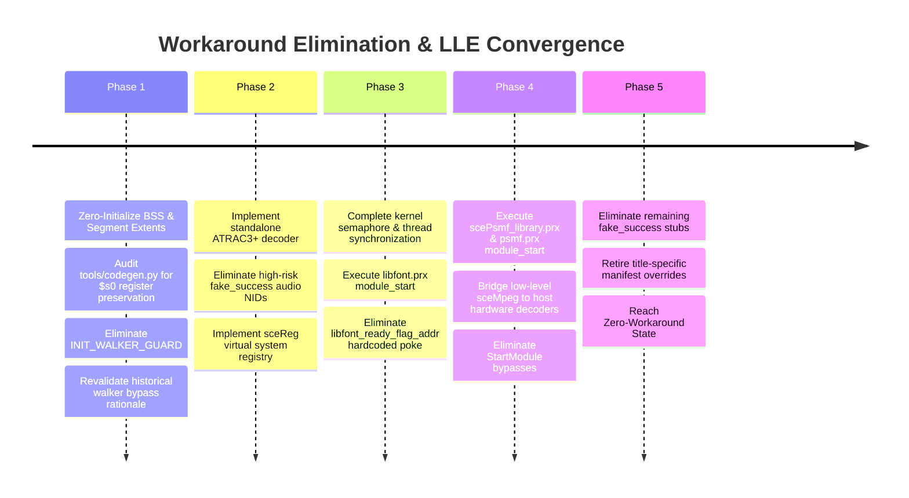

# HLE and Workaround Inventory: System Classification & Migration Plan

## 1. The HLE Budget Doctrine

In accordance with the authentic guest execution doctrine, Nakagawa Recomp tracks and budgets all emulation components across five distinct tiers:

| Tier | Classification | Description | Architectural Objective |
| :--- | :--- | :--- | :--- |
| **Tier 1** | `ORIGINAL_GUEST_EXECUTION` | Compiled MIPS machine code from retail executables and vendor PRX modules executing directly via AOT C chunks or fail-closed interpreter. | **MAXIMIZE** (Target: $\ge 90\%$ of all executed instructions) |
| **Tier 2** | `LLE_RUNTIME` | Low-level hardware virtualization services: register state preservation, MIPS ABI compliance, dynamic dispatch latching, and CPU exception/memory mapping. | **EXPAND & HARDEN** |
| **Tier 3** | `GENERIC_HLE` | Platform OS/kernel abstractions that inherently bridge to the host: thread scheduling, synchronization primitives, Vulkan GE command submission, audio streams, and raw block I/O. | **MAINTAIN STRICTLY GENERIC** |
| **Tier 4** | `TITLE_SPECIFIC_HLE` | Functions or hooks that special-case a specific game title, write hardcoded flags to guest memory, or short-circuit guest execution loops. | **ELIMINATE $\to 0$** |
| **Tier 5** | `PATCH/WORKAROUND` | Fake-success stubs (returning 0 without implementing semantics), loop iteration caps, register clobber guards, and bypasses. | **ELIMINATE $\to 0$** |

### The Cardinal Rule of Lower Layers

For every existing or proposed HLE routine, developers and agents must answer:
> **"Why can this behavior not instead be implemented one layer lower?"**

---

## 2. Quantitative Census of the Current Codebase

Import and hook totals below retain the static audit of `af5c4f4` / `1c672f5`;
the title-configuration and walker descriptions were checked against `faa43e6`.
Run `tools/test_compat_manifest.py` for the current compatibility inventory gate:

```text
================================================================================
NAKAGAWA SUBSYSTEM CENSUS
================================================================================
Import Registrations Audited (import_audit_gate):   377 NIDs
  - Dedicated Implementations:                     319 NIDs (Tier 3 Generic HLE)
  - Fake Success Stubs:                             51 NIDs (Tier 5 Workaround)
  - Controlled Unsupported:                          7 NIDs (Fail-closed)

Dispatch Hooks & Walkers (src/rt/recomp.c):
  - Exact-Match Dispatch Hooks:                     17 sites (Tiers 4 & 5)
  - Address-Range Hooks:                             1 site  (Tier 4)
  - Inline Dispatch Guard (INIT_WALKER_GUARD):        1 site  (Tier 5)
  - WALKER_CAP:                                      historical comment, not an active cap

Title Configuration Overrides (src/rt/title_config.c):
  - Hardcoded Entry Points & Addresses:              0 (generated header/manifest bindings)
  - Dispatch Aliases:                                generated X-macro list (0 in generic build)
  - Callback Terminators:                            generated X-macro list (0 in generic build)
  - Runtime Sync Wrappers:                           generated X-macro list (0 in generic build)
================================================================================
```

---

## 3. Detailed Audit of Existing Workarounds

### 3.1 Title-Specific Memory Writes and Bypasses (Tier 4)

#### 1. `libfont.prx` Initialization Bypass & Compat Flag

- **Location:** `src/rt/hle.c` (`h_LoadModule`, `h_StartModule`) and `src/rt/title_config.c:74` (`SR_TITLE_CONFIG_LIBFONT_READY_FLAG_ADDR`; accessor at lines 190–194).
- **Mechanism:** The title-specific libfont bypass uses `libfont_ready_flag_addr` from the title manifest via generated `sr_title_config.h`, not a hardcoded address in `title_config.c`. That file consumes the generated header at line 20, collection X-macros at lines 26–65, and configuration bindings at lines 67–94.
- **Root Cause:** When `f_32200000` was previously executed, it blocked indefinitely on an unconditional `sceKernelWaitSema`.
- **Lower-Level Solution:** Fix the semaphore initial count and thread scheduling in `src/rt/sched.c` so `libfont.prx` initializes naturally, then remove the hardcoded memory poke.

#### 2. `psmf.prx` and `libpsmfplayer.prx` Start Module Skip

- **Location:** `src/rt/hle.c` (`h_StartModule`).
- **Mechanism:** Explicitly skips calling `f_32280000` (`psmf`) and `f_322f8868` (`libpsmfplayer`).
- **Root Cause:** Sony SDK initialization assumes low-level kernel callbacks and ring buffer allocation.
- **Lower-Level Solution:** Provide faithful kernel memory partition allocation (`sceKernelAllocPartitionMemory`) and let the genuine PSMF modules execute their lifecycle.

#### 3. `INIT_LANG` Hardcoded Japanese Language Injection

- **Location:** `src/rt/recomp.c` (`g_exact_hooks[]`, address `0x00304290`).
- **Mechanism:** Hook intercepts dispatch to `0x00304290` and writes `1` (Japanese language ID) directly into guest memory.
- **Root Cause:** Game reads system language without going through the documented `sceUtilityGetSystemParamInt(PSP_SYSTEMPARAM_ID_INT_LANGUAGE)`.
- **Lower-Level Solution:** Move this into a generic PSP registry/system configuration provider (`sceReg` / `sceUtility`) that initializes the system parameter partition accurately in guest memory before execution begins.

#### 4. Module Table Walker Bypass (`MODTABLE_WALK`)

- **Location:** `src/rt/recomp.c` (`hook_modtable_walk` at `0x0000ef40` and `0x002cf338`).
- **Mechanism:** Intercepts table iteration over reentrancy structures.
- **Root Cause:** Table entries point to data addresses that generated false dispatch misses.
- **Lower-Level Solution:** Distinguish code pointers from data pointers in the analyzer so data structures are never routed to the dynamic execution dispatcher.

---

### 3.2 Register Clobber Guards and Loop Caps (Tier 5)

#### 1. `INIT_WALKER_GUARD` (Callee-Saved `$s0` / `$r16` Preservation)

- **Location:** `src/rt/recomp.c:2063–2075`, inline in `dispatch()`, not a dispatch hook-table entry.
- **Mechanism:** When the caller's `s->pc` is `0x00000f98` or `0x00000fdc`, saves `s->r[16]` around `fn(s)` and unconditionally restores it on return. These PCs select the guard; they are not the dispatch target.
- **Root Cause:** A MIPS ABI violation in recompiled code or compiler optimization where a callee corrupted callee-saved register `$s0`.
- **Lower-Level Solution:** Audit the recompiled functions called by `0x00000fdc` in `tools/codegen.py` to ensure standard MIPS calling conventions preserve `$s0`–`$s7` across function boundaries.

#### 2. `WALKER_CAP` Historical Comment

- **Location:** `src/rt/recomp.c:1586–1607` (comment only; `WALKER_CAP` mentions at lines 1593 and 1601).
- **Mechanism:** The comment describes a former 2048-iteration cap and the rationale for bypassing `f_000008d8` by returning `r[2]=0` directly (`WALKER_SKIP`, lines 1605–1606). It is not an active cap or executable function at those lines.
- **Root Cause:** The historical comment describes recursive walker dispatch and repeated yields starving frame-present progress; it is not current behavioral proof.
- **Lower-Level Solution:** Verify current walker execution and guest table initialization before treating the historical bypass rationale as an active workaround.

---

### 3.3 The 51 Fake-Success Stubs (Tier 5)

`tools/import_audit_baseline.json` registers 51 NIDs with `classification: "fake_success"`. These return `0` without implementing the documented Sony PSP kernel semantics:

| NID | Function Name | Library | Risk to Fidelity | Remediation Path |
| :--- | :--- | :--- | :--- | :--- |
| `0x090ccb3f` | `sceKernelPowerTick` | `ThreadManForUser` | Low | Update internal tick counter; non-blocking |
| `0x0c116e1b` | `sceAtracLowLevelDecode` | `sceAtrac3plus` | **High** | Audio stream drops/stutters; implement ATRAC3+ decoder |
| `0x0cae832b` | `sceRegCloseCategory` | `sceReg` | Medium | Return proper handle state in registry |
| `0x132f1eca` | `sceAtracReinit` | `sceAtrac3plus` | **High** | Audio state inconsistency; implement genuine context reset |
| `0x13407f13` | `sceMpegRingbufferDestruct` | `sceMpeg` | Medium | Ring buffer memory leak; implement buffer free |
| `0x1575d64b` | `sceAtracLowLevelInitDecoder` | `sceAtrac3plus` | **High** | Codec uninitialized; implement decoder context |
| `0x1579a159` | `sceUtilityLoadNetModule` | `sceUtility` | Low | Return `SCE_ERROR_NOT_SUPPORTED` or dummy handle |
| `0x1d8a762e` | `sceRegOpenCategory` | `sceReg` | Medium | Return valid virtual category handle |
| `0x1f4011e6` | `sceCtrlSetSamplingMode` | `sceCtrl` | Low | Store sampling mode in controller state |
| `0x20628e6f` | `sceUmdGetErrorStat` | `sceUmdUser` | Medium | Return genuine UMD drive status (0 = ready) |
| `0x231fc6b7` | `_sceAtracGetContextAddress` | `sceAtrac3plus` | **High** | Guest memory corruption if unmapped context returned |
| `0x28a8e98a` | `sceRegGetKeyValue` | `sceReg` | Medium | Return default system values (language, nickname) |
| `0x2dd3e298` | `sceAtracGetBufferInfoForResetting` | `sceAtrac3plus` | **High** | Audio buffer mismatch |
| `0x31668baa` | `sceAtracGetChannel` | `sceAtrac3plus` | Medium | Return active stereo channel count |
| `0x36aa6e91` | `sceImposeSetLanguageMode` | `sceImpose` | Low | Set display language in impose state |

---

## 4. Workaround Elimination & Migration Roadmap



### The Invariant for Future Work

Every migration step must be accompanied by an automated regression test in `tools/` that executes both the positive and negative paths to prove that guest code executes correctly without synthetic intervention.
