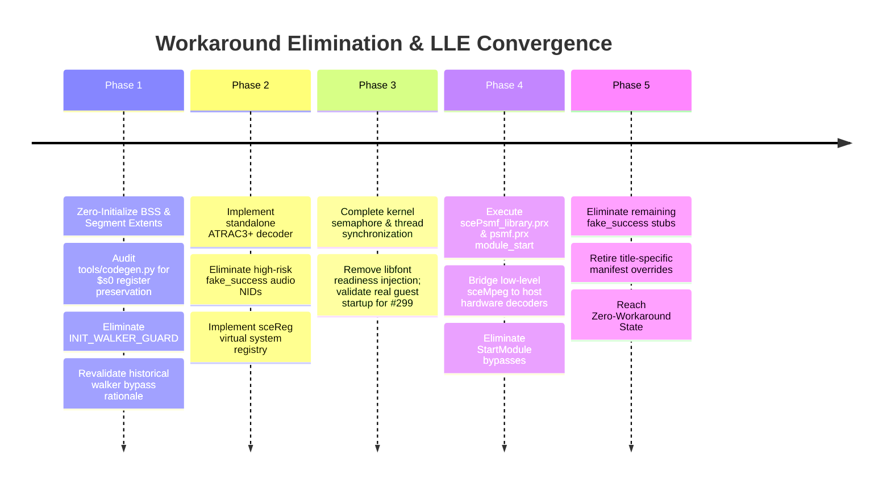

# HLE and Workaround Inventory: System Classification & Migration Plan

## 1. The HLE Budget Doctrine

In accordance with the authentic guest execution doctrine, Nakagawa Recomp tracks and budgets all emulation components across five distinct tiers:

| Tier | Classification | Description | Architectural Objective |
| :--- | :--- | :--- | :--- |
| **Tier 1** | `ORIGINAL_GUEST_EXECUTION` | Compiled MIPS machine code from retail executables and vendor PRX modules executing directly via AOT C chunks or fail-closed interpreter. | **MAXIMIZE** (Target: $\ge 90\%$ of all executed instructions) |
| **Tier 2** | `LLE_RUNTIME` | Low-level hardware virtualization services: register state preservation, MIPS ABI compliance, dynamic dispatch latching, and CPU exception/memory mapping. | **EXPAND & HARDEN** |
| **Tier 3** | `GENERIC_HLE` | Platform OS/kernel abstractions that inherently bridge to the host: thread scheduling, synchronization primitives, Vulkan GE command submission, audio streams, and raw block I/O. | **MAINTAIN STRICTLY GENERIC** |
| **Tier 4** | `TITLE_SPECIFIC_HLE` | Functions or hooks that special-case a specific game title, write hardcoded flags to guest memory, or short-circuit guest execution loops. | **ELIMINATE $\to 0$** |
| **Tier 5** | `PATCH/WORKAROUND` | Fake-success stubs (returning 0 without implementing semantics), loop iteration caps, register clobber guards, and bypasses. | **ELIMINATE $\to 0$** |

### The Cardinal Rule of Lower Layers

For every existing or proposed HLE routine, developers and agents must answer:
> **"Why can this behavior not instead be implemented one layer lower?"**

---

## 2. Quantitative Census of the Current Codebase

HLE registration classes and semantic statuses below are generated by
`python tools/hle_manifest.py --census-markdown build/hle_census.md --census-heading-level 3`;
paste that file between the generated-block markers to regenerate this section; `tools.test_hle_manifest.CensusTests.test_documented_hle_census_matches_generated_source`
fails if its counts or detail rows become stale. `python tools/hle_manifest.py --census-json build/hle_census.json`
(`--census-json` is an alias of `--census`) is the same census as a machine artifact,
and it is the only current source for these counts — including the dedicated-but-unreviewed,
fake-success, controlled-unsupported, partial and compatibility rows. Nothing else in
the tree may hand-write them: `tools/lint_docs.py` rejects a hand-written census count
on a CURRENT page outside this generated block, so a prose figure is either generated
or labelled historical/capture-time. The evidence-tier view
(`HOST_TESTED`, `HARDWARE_MEASURED`, and related tiers) remains available from
`tools/hle_manifest.py --evidence-chain` as a separate evidence dimension.

<!-- BEGIN GENERATED HLE STATUS CENSUS -->
### HLE Semantic Status Census

Registered NIDs: **491** (dedicated **442**, fake_success **5**, controlled_unsupported **44**).
Semantic handler census: **407** handlers across **21** API families, covering **448** handler-associated NID registrations.

| Semantic Status | Handlers | NID Registrations |
| :--- | :---: | :---: |
| `complete` | 10 | 18 |
| `partial` | 62 | 62 |
| `compatibility` | 1 | 1 |
| `controlled_unsupported` | 2 | 6 |
| `unreviewed` | 332 | 361 |

| API Family | Complete | Partial | Compatibility | Controlled Unsupported | Unreviewed | Total Handlers | NID Registrations |
| :--- | :---: | :---: | :---: | :---: | :---: | :---: | :---: |
| `newlib` | 0 | 0 | 0 | 0 | 1 | 1 | 1 |
| `other` | 1 | 0 | 0 | 0 | 0 | 1 | 1 |
| `sceAtrac` | 0 | 0 | 0 | 0 | 24 | 24 | 33 |
| `sceAudio` | 0 | 0 | 0 | 0 | 13 | 13 | 14 |
| `sceCtrl` | 0 | 1 | 0 | 0 | 6 | 7 | 7 |
| `sceDisplay` | 1 | 3 | 0 | 0 | 10 | 14 | 14 |
| `sceDmac` | 0 | 2 | 0 | 0 | 0 | 2 | 2 |
| `sceFont` | 0 | 0 | 0 | 0 | 9 | 9 | 9 |
| `sceGe` | 0 | 4 | 0 | 0 | 8 | 12 | 12 |
| `sceImpose` | 0 | 0 | 0 | 0 | 2 | 2 | 2 |
| `sceIo` | 2 | 18 | 0 | 0 | 12 | 32 | 32 |
| `sceKernel` | 2 | 20 | 0 | 0 | 134 | 156 | 180 |
| `sceMpeg` | 0 | 8 | 0 | 1 | 27 | 36 | 36 |
| `sceOpen` | 0 | 0 | 0 | 0 | 1 | 1 | 1 |
| `scePower` | 0 | 0 | 0 | 0 | 9 | 9 | 9 |
| `scePsmf` | 0 | 2 | 0 | 0 | 12 | 14 | 14 |
| `sceRtc` | 4 | 4 | 0 | 0 | 0 | 8 | 8 |
| `sceSas` | 0 | 0 | 0 | 1 | 27 | 28 | 32 |
| `sceUmd` | 0 | 0 | 1 | 0 | 7 | 8 | 8 |
| `sceUtility` | 0 | 0 | 0 | 0 | 28 | 28 | 30 |
| `sceWlan` | 0 | 0 | 0 | 0 | 2 | 2 | 3 |
| **Total** | **10** | **62** | **1** | **2** | **332** | **407** | **448** |

#### Complete Handlers (Evidence-Backed)

- **`h_Strlen`** (`other`): `strlen` (0x52df196c)
  - Evidence: src/rt/hle_thread_selftest.c:test_sysclib_memory_imports
  - Evidence: src/rt/hle.c:h_Strlen
  - Evidence: public C library contract (strlen)
- **`h_DisplayGetFramePerSec`** (`sceDisplay`): `sceDisplayGetFramePerSec` (0xdba6c4c4)
  - Evidence: src/rt/hle_thread_selftest.c:test_display_frame_per_sec_float_return
  - Evidence: tools/test_hle_manifest.py:FindingRuleTests.test_float_return_metadata_is_live_and_dedicated
  - Evidence: hardware oracle / issue #80 display-clock measurement (59.9400599f in $f0)
- **`h_IoMkdir`** (`sceIo`): `sceIoMkdir` (0x06a70004)
  - Evidence: src/rt/hle_thread_selftest.c:test_ms0_unified_namespace
  - Evidence: src/rt/hle.c:h_IoMkdir
- **`h_IoRemove`** (`sceIo`): `sceIoRemove` (0xf27a9c51)
  - Evidence: src/rt/hle_thread_selftest.c:test_ms0_unified_namespace
  - Evidence: src/rt/hle.c:h_IoRemove
- **`h_Memset`** (`sceKernel`): `memset` (0x10f3bb61), `sceKernelMemset` (0xa089eca4)
  - Evidence: src/rt/hle_thread_selftest.c:test_sysclib_memory_imports
  - Evidence: src/rt/hle.c:h_Memset
  - Evidence: public C library contract (memset)
- **`h_SetCompiledSdkVersion`** (`sceKernel`): `sceKernelSetCompiledSdkVersion603_605` (0x1b4217bc), `sceKernelSetCompiledSdkVersion370` (0x342061e5), `sceKernelSetCompiledSdkVersion600_602` (0x35669d4c), `sceKernelSetCompiledSdkVersion606` (0x358ca1bb), `sceKernelSetCompiledSdkVersion` (0x7591c7db), `sceKernelSetCompiledSdkVersion500_505` (0x91de343c), `sceKernelSetCompiledSdkVersion395` (0xebd5c3e6), `sceKernelSetCompilerVersion` (0xf77d77cb)
  - Evidence: src/rt/sdkver_selftest.c
  - Evidence: tools/test_sdkver_c.py
  - Evidence: public ABI (PSPSDK sdkver.h: sceKernelSetCompiledSdkVersion)
- **`h_RtcGetCurrentClock`** (`sceRtc`): `sceRtcGetCurrentClock` (0x4cfa57b0)
  - Evidence: src/rt/hle_thread_selftest.c:test_time_domains_are_coherent
  - Evidence: src/rt/hle_thread_selftest.c:test_rtc_pointer_validation_and_measured_conversions
  - Evidence: src/rt/hle.c:h_RtcGetCurrentClock
  - Evidence: public PSPSDK contract (psprtc.h: sceRtcGetCurrentClock, tz is minutes from UTC)
  - Evidence: PSPAutotests tests/rtc/rtc.expected (0/+13/+60/-60/-600000/INT_MAX/-INT_MAX all return 0; -60 is one hour before the UTC baseline)
- **`h_RtcGetCurrentTick`** (`sceRtc`): `sceRtcGetCurrentTick` (0x3f7ad767)
  - Evidence: src/rt/hle_thread_selftest.c:test_time_domains_are_coherent
  - Evidence: src/rt/hle_thread_selftest.c:test_rtc_pointer_validation_and_measured_conversions
  - Evidence: src/rt/hle.c:h_RtcGetCurrentTick
  - Evidence: public PSPSDK contract (psprtc.h: sceRtcGetCurrentTick, 0 on success, <0 on error)
  - Evidence: PSPAutotests tests/rtc/rtc.expected (tick advances across a 2 ms delay)
- **`h_RtcGetTick`** (`sceRtc`): `sceRtcGetTick` (0x6ff40acc)
  - Evidence: src/rt/hle_thread_selftest.c:test_rtc_conversion_errors_and_full_range
  - Evidence: src/rt/hle_thread_selftest.c:test_rtc_pointer_validation_and_measured_conversions
  - Evidence: src/rt/hle.c:h_RtcGetTick
  - Evidence: public PSPSDK contract (psprtc.h: sceRtcGetTick, pspRtcCheckValidErrors component ranges)
  - Evidence: PSPAutotests tests/rtc/convert.expected (year 0/10000 -> 0x800001fe with output untouched; year 10/9998/9999 exact ticks)
- **`h_RtcSetTick`** (`sceRtc`): `sceRtcSetTick` (0x7ed29e40)
  - Evidence: src/rt/hle_thread_selftest.c:test_rtc_conversion_errors_and_full_range
  - Evidence: src/rt/hle_thread_selftest.c:test_rtc_pointer_validation_and_measured_conversions
  - Evidence: src/rt/hle.c:h_RtcSetTick
  - Evidence: public PSPSDK contract (psprtc.h: sceRtcSetTick, 0 on success, <0 on error)
  - Evidence: PSPAutotests tests/rtc/convert.expected (checkSetTick: 835072 -> 0001-01-01, 62135596800000000 -> 1970-01-01)

#### Partial Handlers (Named Limitations)

- **`h_CtrlGetSamplingMode`** (`sceCtrl`): `sceCtrlGetSamplingMode` (0xda6b76a1)
  - Limitation: reports the mode retained by sceCtrlSetSamplingMode but does not change the sampled SceCtrlData; the invalid-pointer error code (ILLEGAL_ADDR) is not hardware measured
- **`h_DisplaySetFrameBuf`** (`sceDisplay`): `sceDisplaySetFrameBuf` (0x289d82fe)
  - Limitation: display-smoke covers only a sync=1 8888 flip with stride 512; other format, address, stride, and error-precedence cases remain outside this route (#341)
  - Evidence: Makefile:display-smoke-run
  - Evidence: fixtures/display_smoke/generate.py:verify
  - Evidence: fixtures/display_smoke/generate.py:run
- **`h_DisplayWaitVblankStart`** (`sceDisplay`): `sceDisplayWaitVblankStart` (0x984c27e7)
  - Limitation: display-smoke covers ordinary guest-thread waits; interrupt-context behavior and callback wait variants remain outside this route (#341)
  - Evidence: Makefile:display-smoke-run
  - Evidence: fixtures/display_smoke/generate.py:run
  - Evidence: tools/test_sched_invariants.py:test_the_two_display_nids_have_separate_handlers
- **`h_DisplayWaitVblankStartMulti`** (`sceDisplay`): `sceDisplayWaitVblankStartMulti` (0x40f1469c)
  - Limitation: waits the requested positive count of scheduler VBLANK periods; zero-count behavior fails closed as not implemented, while callback/context precedence and hardware timing are not measured
- **`h_DmacMemcpy`** (`sceDmac`): `sceDmacMemcpy` (0x617f3fe6)
  - Limitation: concurrent-DMA BUSY behavior and invalid truncated-tail validation precedence unmodeled (#303, #341)
- **`h_DmacTryMemcpy`** (`sceDmac`): `sceDmacTryMemcpy` (0xd97f94d8)
  - Limitation: concurrent-DMA BUSY behavior and invalid truncated-tail validation precedence unmodeled (#303, #341)
- **`h_GeBreak`** (`sceGe`): `sceGeBreak` (0xb448ec0d)
  - Limitation: models synchronous display list pause (mode 0) and queue cancellation (mode 1); argument and parameter buffer inspection are K1/read checked only, asynchronous hardware command boundary timing remains unmodeled (#341); the 0x80000025 result when no list is active and the paused (2) and cancelled (4) sync statuses are not hardware-measured
  - Evidence: src/rt/hle_thread_selftest.c:test_ge_break_continue
- **`h_GeContinue`** (`sceGe`): `sceGeContinue` (0x4c06e472)
  - Limitation: resumes a paused display list using the synchronous GE runner; hardware timing and multi-queue priority ordering remain unmodeled (#341); the 0x80000025 result when no list is paused is not hardware-measured
  - Evidence: src/rt/hle_thread_selftest.c:test_ge_break_continue
- **`h_GeListEnQueue`** (`sceGe`): `sceGeListEnQueue` (0xab49e76a)
  - Limitation: display-smoke covers one unstalled synchronous list; ring-buffer stall deferral, a full list table (slot 0 is reused), argument and priority validation, and asynchronous execution timing remain outside this route (#341)
  - Evidence: Makefile:display-smoke-run
  - Evidence: fixtures/display_smoke/generate.py:flight_smoke
  - Evidence: src/rt/hle_thread_selftest.c:test_flight_recorder_ge_present_events
- **`h_GeListEnQueueHead`** (`sceGe`): `sceGeListEnQueueHead` (0x1c0d95a6)
  - Limitation: idle-list execution follows the shared enqueue path; head ordering is refused while a list is stalled, and asynchronous queue behavior remains unmodeled
- **`h_IoChangeAsyncPriority`** (`sceIo`): `sceIoChangeAsyncPriority` (0xb293727f)
  - Limitation: priority selects queued host requests, but PSP priority ordering and its interaction with callbacks are not hardware-measured
  - Evidence: src/rt/hle_thread_selftest.c:test_io_async_and_path_imports
- **`h_IoChdir`** (`sceIo`): `sceIoChdir` (0x55f4717d)
  - Limitation: the modeled current directory is per-thread and resolves contained Memory Stick paths; PSP behavior for other devices is not established
  - Evidence: src/rt/hle_thread_selftest.c:test_io_async_and_path_imports
- **`h_IoChstat`** (`sceIo`): `sceIoChstat` (0xb8a740f4)
  - Limitation: only the mode field is supported; attribute, size, and timestamp fields fail closed with IO_CHSTAT_NON_MODE_FIELDS
  - Evidence: src/rt/hle_thread_selftest.c:test_io_async_and_path_imports
- **`h_IoCloseAsync`** (`sceIo`): `sceIoCloseAsync` (0xff5940b6)
  - Limitation: request completion uses a deterministic synthetic import-boundary scheduler; close callback timing remains unmeasured
  - Evidence: src/rt/hle_thread_selftest.c:test_fd_namespace
- **`h_IoDevctl`** (`sceIo`): `sceIoDevctl` (0x54f5fb11)
  - Limitation: Memory Stick devctl callback events unmodeled (#341)
- **`h_IoGetAsyncStat`** (`sceIo`): `sceIoGetAsyncStat` (0xcb05f8d6)
  - Limitation: the pending interval is a deterministic synthetic import-boundary policy, not PSP-measured timing
  - Evidence: src/rt/hle_thread_selftest.c:test_io_async_and_path_imports
- **`h_IoIoctlAsync`** (`sceIo`): `sceIoIoctlAsync` (0xe95a012b)
  - Limitation: request completion uses a deterministic synthetic import-boundary scheduler; PSP ioctl timing and callback ordering remain unmeasured
  - Evidence: src/rt/hle_thread_selftest.c:test_io_async_and_path_imports
- **`h_IoLseek32Async`** (`sceIo`): `sceIoLseek32Async` (0x1b385d8f)
  - Limitation: request completion uses a deterministic synthetic import-boundary scheduler; PSP timing and callback ordering remain unmeasured
  - Evidence: src/rt/hle_thread_selftest.c:test_io_async_and_path_imports
- **`h_IoLseekAsync`** (`sceIo`): `sceIoLseekAsync` (0x71b19e77)
  - Limitation: request completion uses a deterministic synthetic import-boundary scheduler; 64-bit seek timing and callback ordering are not hardware-measured
  - Evidence: src/rt/hle_thread_selftest.c:test_io_async_and_path_imports
- **`h_IoOpenAsync`** (`sceIo`): `sceIoOpenAsync` (0x89aa9906)
  - Limitation: open completes its host lookup at submission to return the PSP-visible fd; async timing and callback ordering are synthetic, not hardware-measured
  - Evidence: src/rt/hle_thread_selftest.c:test_fd_namespace
- **`h_IoPollAsync`** (`sceIo`): `sceIoPollAsync` (0x3251ea56)
  - Limitation: the pending interval is a deterministic synthetic import-boundary policy, not PSP-measured timing
  - Evidence: src/rt/hle_thread_selftest.c:test_io_async_and_path_imports
- **`h_IoReadAsync`** (`sceIo`): `sceIoReadAsync` (0xa0b5a7c2)
  - Limitation: request completion uses a deterministic synthetic import-boundary scheduler; PSP timing and callback ordering remain unmeasured
  - Evidence: src/rt/hle_thread_selftest.c:test_io_async_and_path_imports
- **`h_IoRmdir`** (`sceIo`): `sceIoRmdir` (0x1117c65f)
  - Limitation: empty-directory removal and nonempty refusal are tested with synthetic roots; PSP error precedence beyond those cases remains unmeasured
  - Evidence: src/rt/hle_thread_selftest.c:test_io_async_and_path_imports
- **`h_IoSetAsyncCallback`** (`sceIo`): `sceIoSetAsyncCallback` (0xa12a0514)
  - Limitation: completion queues the modeled thread callback; PSP callback argument and interleaving behavior remain unmeasured
  - Evidence: src/rt/hle_thread_selftest.c:test_io_async_and_path_imports
- **`h_IoSync`** (`sceIo`): `sceIoSync` (0xab96437f)
  - Limitation: Memory Stick handles are flushed and synced; other devices and nonzero unknown arguments fail closed with IO_SYNC_DEVICE or IO_SYNC_ARGUMENT
  - Evidence: src/rt/hle_thread_selftest.c:test_io_async_and_path_imports
- **`h_IoWaitAsync`** (`sceIo`): `sceIoWaitAsync` (0xe23eec33)
  - Limitation: the host operation runs when the guest waits; PSP blocking, wake, and callback interleaving remain unmeasured
  - Evidence: src/rt/hle_thread_selftest.c:test_io_async_and_path_imports
- **`h_IoWaitAsyncCB`** (`sceIo`): `sceIoWaitAsyncCB` (0x35dbd746)
  - Limitation: callback dispatch is modeled at the wait boundary; PSP blocking and callback interleaving remain unmeasured
- **`h_IoWriteAsync`** (`sceIo`): `sceIoWriteAsync` (0x0facab19)
  - Limitation: request completion uses a deterministic synthetic import-boundary scheduler; PSP timing and callback ordering remain unmeasured
  - Evidence: src/rt/hle_thread_selftest.c:test_io_async_and_path_imports
- **`h_AllocMemoryBlock`** (`sceKernel`): `sceKernelAllocMemoryBlock` (0xfe707fdf)
  - Limitation: models main-user-partition Low placement with the four-byte options header; valid High, Addr, LowAligned, HighAligned, and extended-options forms are refused, and allocation fragmentation/error precedence are not hardware measured
- **`h_CancelAlarm`** (`sceKernel`): `sceKernelCancelAlarm` (0x7e65b999)
  - Limitation: an unknown, cancelled or already-finished alarm UID returns the hardware-measured unknown-alarm code; treating a one-shot that has already fired as unknown (its UID is released when the handler returns 0) is the project's model and is not separately measured
  - Evidence: src/rt/hle_thread_selftest.c:test_alarm_registration_and_error_codes
  - Evidence: src/rt/hle_thread_selftest.c:test_alarm_cancel_before_firing_prevents_the_handler
  - Evidence: src/rt/sched_selftest.c:test_alarm_cancel_and_ordering
- **`h_CancelReceiveMbx`** (`sceKernel`): `sceKernelCancelReceiveMbx` (0x87d4dd36)
  - Limitation: cancel with zero waiters and invalid numWait-thread pointer error class unmeasured (#339, #341)
- **`h_CreateMbx`** (`sceKernel`): `sceKernelCreateMbx` (0x8125221d)
  - Limitation: NULL-name create error and interrupt-context placement unmeasured (#339, #341)
- **`h_DeleteMbx`** (`sceKernel`): `sceKernelDeleteMbx` (0x86255ada)
  - Limitation: delete-while-waited is corroborated by campaign psp-hw-20260917 but not mailbox-measured; interrupt-context placement unmeasured (#339, #341)
- **`h_FreeMemoryBlock`** (`sceKernel`): `sceKernelFreeMemoryBlock` (0x50f61d8a)
  - Limitation: releases UIDs created by the modeled Low allocation path; invalid-UID result is source-tested but not hardware measured
- **`h_GetMemoryBlockAddr`** (`sceKernel`): `sceKernelGetMemoryBlockAddr` (0xdb83a952)
  - Limitation: resolves UIDs created by the modeled Low allocation path; output-pointer and unknown-UID results are source-tested but not hardware measured
- **`h_PollMbx`** (`sceKernel`): `sceKernelPollMbx` (0x0d81716a)
  - Limitation: invalid-message-pointer error class unmeasured (#339, #341)
- **`h_ReceiveMbx`** (`sceKernel`): `sceKernelReceiveMbx` (0x18260574)
  - Limitation: ILLEGAL_CONTEXT precedence for a blocking receive unmeasured; priority-mailbox circular linking not separately asserted beyond campaign facts (#339, #341)
- **`h_ReceiveMbxCB`** (`sceKernel`): `sceKernelReceiveMbxCB` (0xf3986382)
  - Limitation: callback-dispatch interleaving during a mailbox wait unmeasured; ILLEGAL_CONTEXT precedence unmeasured (#339, #341)
- **`h_ReferMbxStatus`** (`sceKernel`): `sceKernelReferMbxStatus` (0xa8e8c846)
  - Limitation: size-field caller contract (whether Refer preserves or overwrites size) unmeasured (#339, #341)
- **`h_ReferSemaStatus`** (`sceKernel`): `sceKernelReferSemaStatus` (0xbc6febc5)
  - Limitation: reports the modeled count, create-time initCount, maxCount, attr, name and blocked-waiter count; the caller size word is left as written and the full 56-byte span is written, a convention copied from ReferEventFlagStatus that is not hardware measured; unknown-UID and bad-pointer codes are source-selftested only
- **`h_ReferThreadStatus`** (`sceKernel`): `sceKernelReferThreadStatus` (0x17c1684e)
  - Limitation: run clocks use host scheduler time and preemption/release counters are modeled rather than PSP-measured (#311)
- **`h_ResumeThread`** (`sceKernel`): `sceKernelResumeThread` (0x75156e8f)
  - Limitation: resume clears the scheduler suspension flag and applies strict-priority preemption; the not-suspended and DORMANT codes are hardware measured, while resume of UID 0 (the running caller) answers the not-suspended code without a measurement and interrupt/dispatch-context precedence is unmeasured
  - Evidence: src/rt/hle_thread_selftest.c:test_suspend_resume_errors_and_ready_thread
  - Evidence: src/rt/sched_selftest.c:test_suspend_resume_error_codes
- **`h_RotateThreadReadyQueue`** (`sceKernel`): `sceKernelRotateThreadReadyQueue` (0x912354a7)
  - Limitation: rotates the cyclic slot-order ready queue of one priority (0 selects the caller's priority) and yields when the caller leads that queue; no range-error code is returned for an out-of-range priority because none is sourced, and ordering relative to threads that become ready after the rotation is not hardware measured
  - Evidence: src/rt/hle_thread_selftest.c:test_rotate_ready_queue_selection_order
  - Evidence: src/rt/hle_thread_selftest.c:test_rotate_equal_priority_yields_to_peers
  - Evidence: src/rt/sched_selftest.c:test_rotate_ready_queue_moves_head_behind_peers
- **`h_SendMbx`** (`sceKernel`): `sceKernelSendMbx` (0xe9b3061e)
  - Limitation: invalid-message-pointer error class unmeasured; interrupt-context placement unmeasured (#339, #341)
- **`h_SetAlarm`** (`sceKernel`): `sceKernelSetAlarm` (0x6652b8ca)
  - Limitation: the handler runs in interrupt context at the next interrupt-service point once the guest-time deadline passes (so it can run later than the deadline, and only while CPU interrupts are enabled) and a non-zero return re-arms the alarm that many microseconds after delivery, which is hardware measured only as 'reschedules'; a NULL handler returns the invalid-address code and a full alarm table the out-of-resources code without a measurement, SetAlarm(0) is accepted without a measurement, the interrupt-context rules for blocking waits made from a handler are the per-API ones (unmeasured for most waits), and the SysClock variants (sceKernelSetSysClockAlarm, sceKernelReferAlarmStatus) are not implemented
  - Evidence: src/rt/hle_thread_selftest.c:test_alarm_one_shot_fires_once_at_its_time_with_its_argument
  - Evidence: src/rt/hle_thread_selftest.c:test_alarm_rearm_by_return_value
  - Evidence: src/rt/hle_thread_selftest.c:test_alarm_handler_runs_under_interrupt_context_rules
  - Evidence: src/rt/hle_thread_selftest.c:test_alarm_idle_scheduler_advances_to_the_deadline
  - Evidence: src/rt/sched_selftest.c:test_alarm_runs_at_its_deadline_in_interrupt_context
  - Evidence: src/rt/sched_selftest.c:test_alarm_is_a_wake_source_for_the_idle_scheduler
- **`h_SuspendThread`** (`sceKernel`): `sceKernelSuspendThread` (0x9944f31f)
  - Limitation: suspend is a scheduler flag (no nesting count); a waiting thread still completes its wait while suspended and runs only after resume; DORMANT and double-suspend codes are hardware measured, while the code for suspending UID 0 or the calling thread reuses the thread-object refusal code without a suspend-specific measurement, and interrupt/dispatch-context precedence is unmeasured
  - Evidence: src/rt/hle_thread_selftest.c:test_suspend_resume_errors_and_ready_thread
  - Evidence: src/rt/hle_thread_selftest.c:test_suspended_waiter_keeps_wait_semantics
  - Evidence: src/rt/sched_selftest.c:test_suspended_wait_still_completes
- **`h_SysClock2USec`** (`sceKernel`): `sceKernelSysClock2USec` (0xba6b92e2)
  - Limitation: uses the runtime's microsecond system-clock representation and splits it into low/high outputs; hardware conversion and error-precedence cells are not measured
- **`h_SysClock2USecWide`** (`sceKernel`): `sceKernelSysClock2USecWide` (0xe1619d7c)
  - Limitation: takes the 64-bit clock as the $a0/$a1 pair and writes its low/high words through $a2/$a3 on the same microsecond representation as h_SysClock2USec; invalid-output-pointer error code and hardware conversion are not measured
- **`h_MpegAvcCopyYCbCr`** (`sceMpeg`): `sceMpegAvcCopyYCbCr` (0x0558b075)
  - Limitation: Copy copies the modeled guest bytes and retained picture state; PSP plane layout and overlap behavior still need an oracle (#302)
- **`h_MpegAvcCsc`** (`sceMpeg`): `sceMpegAvcCsc` (0x31bd0272)
  - Limitation: Csc writes the retained decoded picture; guest plane bytes are modeled, not the PSP layout, and range/coherency behavior remains open (#302)
- **`h_MpegAvcDecodeStopYCbCr`** (`sceMpeg`): `sceMpegAvcDecodeStopYCbCr` (0xf2930c9c)
  - Limitation: Stop clears tracked state, but the firmware buffered-picture status is explicitly unmeasured rather than reported as a guessed frame count (#302)
- **`h_MpegAvcDecodeYCbCr`** (`sceMpeg`): `sceMpegAvcDecodeYCbCr` (0xf0eb1125)
  - Limitation: Decode marks decoded pictures ready; guest plane bytes remain modeled zeroes, not the PSP layout, while Csc writes the retained decoded picture (#302)
- **`h_MpegAvcInitYCbCr`** (`sceMpeg`): `sceMpegAvcInitYCbCr` (0x67179b1b)
  - Limitation: Init zeroes a modeled guest allocation; its plane bytes are not asserted to match the PSP header/plane layout (#302)
- **`h_MpegAvcQueryYCbCrSize`** (`sceMpeg`): `sceMpegAvcQueryYCbCrSize` (0x211a057c)
  - Limitation: the YCbCr size formula, pointer preflight, and guest geometry are source-tested; firmware mode coverage and the hardware-oracle contract remain open (#302)
- **`h_MpegChangeGetAuMode`** (`sceMpeg`): `sceMpegChangeGetAuMode` (0x9dcfb7ea)
  - Limitation: decode mode is validated and retained; skip mode fails closed because its queue/timestamp effect is not measured (#302)
- **`h_MpegQueryPcmEsSize`** (`sceMpeg`): `sceMpegQueryPcmEsSize` (0xc02cf6b5)
  - Limitation: the public 320-byte LPCM ES/output sizes are retained, but no PCM stream is exposed by this runtime (#302)
- **`h_PsmfGetAudio`** (`scePsmf`): `scePsmfPlayerGetAudioData` (0xb9848a74)
  - Limitation: host HLE player; requires host codec backend; stages 2048 stereo s16 frames; no hardware comparison tier measured (#341)
- **`h_PsmfGetVideo`** (`scePsmf`): `scePsmfPlayerGetVideoData` (0x46f61f8b)
  - Limitation: host HLE player; requires host codec backend; no hardware comparison tier measured (#341)
- **`h_RtcConvertLocalToUtc`** (`sceRtc`): `sceRtcConvertLocalTimeToUTC` (0x779242a2)
  - Limitation: runs on the fixed UTC timezone constant until #77 (non-UTC console local time unimplemented) and its checked-overflow failure class is not autotest-verified (#77, #341)
- **`h_RtcConvertUtcToLocal`** (`sceRtc`): `sceRtcConvertUtcToLocalTime` (0x34885e0d)
  - Limitation: runs on the fixed UTC timezone constant until #77 (non-UTC console local time unimplemented) and its checked-overflow failure class is not autotest-verified (#77, #341)
- **`h_RtcGetCurrentClockLocal`** (`sceRtc`): `sceRtcGetCurrentClockLocalTime` (0xe7c27d1b)
  - Limitation: timezone/daylight comes from the fixed UTC constant until #77 adds the settable system profile, so LocalTime matches only a UTC-configured PSP (#77, #80, #341)
- **`h_RtcGetWin32FileTime`** (`sceRtc`): `sceRtcGetWin32FileTime` (0xcf561893)
  - Limitation: cold-first-call error reporting may differ from firmware (PSPAutotests convert.c notes errors report properly only after a prior error and that the rules are hard to determine); component bounds beyond the measured year/epoch/day-carry cases stay fail-closed rather than measured (#341)

#### Compatibility Handlers (Named Limitations)

- **`h_UmdGetErrorStat`** (`sceUmd`): `sceUmdGetErrorStat` (0x20628e6f)
  - Limitation: returns no error under virtual ISO drive; other drive-error states unmodeled (#341)

#### Controlled Unsupported Dedicated Handlers

- **`h_MpegGetPcmAu`** (`sceMpeg`): `sceMpegGetPcmAu` (0x8c1e027d)
- **`h_SasUnsupportedVoice`** (`sceSas`): `__sceSasSetVoiceATRAC3` (0x4aa9ead6), `__sceSasConcatenateATRAC3` (0x7497ea85), `__sceSasSetTrianglarWave` (0xa232cbe6), `__sceSasSetSteepWave` (0xd5ebbbcd), `__sceSasUnsetATRAC3` (0xf6107f00)
<!-- END GENERATED HLE STATUS CENSUS -->

```text
Dispatch Hooks & Walkers (src/rt/recomp.c):
  - Exact-Match Dispatch Hooks:                      8 sites (Tier 5, diagnostic only)
  - Address-Range Hooks:                             0 sites (retired by issue #362)
  - Inline Dispatch Guard (INIT_WALKER_GUARD):        1 site  (Tier 5)
  - WALKER_CAP:                                      historical comment, not an active cap

  Every surviving g_exact_hooks[] entry is a read-only trace that always falls
  through to normal dispatch, and g_range_hooks[] is empty: generic dispatch no
  longer turns any target shape into a success. Issue #362 removed the last
  behavior-changing target predicates (see 3.1 and 3.4).
  `tools/compat_overrides.py` (DISPATCH_HOOKS / DISPATCH_RANGE_HOOKS) is the
  maintained census for these tables; `tools/test_compat_manifest.py` and
  `tools/test_dispatch_c.py` fail if a source address or a retired hook name
  reappears without being inventoried.

Title Configuration Overrides (src/rt/title_config.c):
  - Hardcoded Entry Points & Addresses:              0 (generated header/manifest bindings)
  - Dispatch Aliases:                                generated X-macro list (0 in generic build)
  - Callback Terminators:                            generated X-macro list (0 in generic build)
  - Runtime Sync Wrappers:                           generated X-macro list (0 in generic build)
================================================================================
```

---

## 3. Detailed Audit of Existing Workarounds

### 3.1 Title-Specific Memory Writes and Bypasses (Tier 4)

#### 1. `libfont.prx` Startup Refusal Boundary

- **Location:** `src/rt/hle.c` (`h_LoadModule`, `h_StartModule`) and the runtime-binding validators.
- **Mechanism:** `sceKernelLoadModule` leaves readiness untouched. `sceKernelStartModule` runs a translated guest `libfont.prx` entry when the `SR_REAL_MODULE_START` gate allows it (`1` for any module, unset for `libfont` only, `0` never). If startup is unavailable (untranslated entry, no recorded entry, or the kill switch), it reports `LIBFONT_STARTUP_UNAVAILABLE`, leaves guest memory unchanged and returns `SCE_KERNEL_ERROR_NOTIMP`. A repeated successful start still refuses re-entry. Legacy manifests that set `libfont_ready_flag_addr` fail validation with `LIBFONT_READY_FLAG_RETIRED` and a migration sentence.
- **Root Cause:** An earlier compatibility bypass skipped `module_start` and wrote readiness during load. Translated startup and export routing now have a source-owned production-path fixture. Real-title startup readiness remains unverified when no locally supplied decrypted executable and PRXs are available.
- **Lower-Level Solution:** Provide translated guest startup and its kernel, thread, callback, heap and file dependencies; remove the retired field from existing manifests.

#### 2. `psmf.prx` and `libpsmfplayer.prx` Start Module Skip

- **Location:** `src/rt/hle.c` (`h_StartModule`).
- **Mechanism:** Explicitly skips calling `f_32280000` (`psmf`) and `f_322f8868` (`libpsmfplayer`).
- **Root Cause:** Sony SDK initialization assumes low-level kernel callbacks and ring buffer allocation.
- **Lower-Level Solution:** Provide faithful kernel memory partition allocation (`sceKernelAllocPartitionMemory`) and let the genuine PSMF modules execute their lifecycle.

#### 3. `INIT_LANG` Hardcoded Japanese Language Injection

- **Location:** was `src/rt/recomp.c` (`g_exact_hooks[]`).
- **Status:** **RETIRED (issue #362).** The hook and its table entry are gone; the
  address no longer exists in generic runtime source. Language now reaches the
  guest through the ordinary system-parameter path, and dispatch to that address
  follows the generic contract: registered body, interpreter, or fail-closed
  rejection.
- **Mechanism (historical):** the hook intercepted dispatch to the address and
  wrote the Japanese language ID directly into guest memory.
- **Root Cause:** the game read the system language without going through the
  documented `sceUtilityGetSystemParamInt(PSP_SYSTEMPARAM_ID_INT_LANGUAGE)`.
- **Lower-Level Solution (applied):** the language value is supplied through the
  generic PSP registry/system-parameter provider, so no dispatch site needs a
  title-derived write.

#### 4. Module Table Walker Bypass (`MODTABLE_WALK`)

- **Location:** was `src/rt/recomp.c` (`hook_modtable_walk`).
- **Status:** **RETIRED (issue #362).** The hook, its table entry and its
  compatibility-census record are gone. Reentrancy/module-table targets now take
  the ordinary miss path and cannot be reported as successful calls.
- **Mechanism (historical):** intercepted table iteration over reentrancy
  structures and swallowed the resulting lookups.
- **Root Cause:** table entries point at data addresses that produced false
  dispatch misses.
- **Lower-Level Solution:** the analyzer's pointer classification (code vs data)
  was corrected, so data words are no longer routed to the dynamic execution
  dispatcher; anything that still misses fails closed instead of succeeding.

#### 5. Retired target-pattern swallows (issue #362)

The following former behaviors were removed from `src/rt/recomp.c` because each
one converted an invalid or unknown target into a successful return:

| Former hook | Shape it swallowed |
| :--- | :--- |
| `RESOURCE_HANDLE` (range) | any target whose top byte was `0x33`, `0x44`, `0x55` or `0x88` |
| `NULL_CALL_A` / `NULL_CALL_B` | a computed target of `0` |
| `SCEDMAC` | the ASCII-looking target `0x32305f34` |
| `_REENT_DATA` / `MODTABLE_WALK` | reentrancy/module-table data words |
| `MOD_STUB` | unresolved module stubs |
| `PLT_TRAMP` | the unresolved PLT trampoline target `0x0000100c` |
| `HINSERT` | zero-capacity hash-insert bypass |
| `INIT_LANG` | forced guest language write (3 above) |

**Generic dispatch contract after #362.** A dispatch target is resolved only by
(1) a registered recompiled body, (2) the relocation/segment normalization or
late-import bridge, (3) a configured title alias, or (4) the fail-closed
guest interpreter floor. Nothing else returns success. If a target is unknown,
corrupt, data-looking, null, or unresolved, the poisoned register state and
caller PC are preserved and the request is rejected (which the public
`dispatch()` wrapper turns into process termination) rather than swallowed.

`src/rt/dispatch_isolation_selftest.c` carries the source-owned hostile matrix
(one target from each former range, every retained magic value, null,
unresolved PLT, module-table and data-looking shapes, plus legitimate
configured-alias and terminator controls) and is built for the generic and both
public fixture configurations, so a title cannot inherit any of these shapes and
a broad pattern reintroduced into `recomp.c` fails the build immediately.

No title-scoped recovery remains for these shapes, and no generic replacement
was introduced: an unconfigured build treats every one of them as ordinary
traffic. Evidence tiers stay separate -- the removal itself is proven by the
public source-owned matrix above, while the private title's post-removal
progression is private acceptance evidence (boot stages through module and
SGX/audio bring-up with no dispatch-miss or fatal-dispatch event) and is not
reproduced here.

---

### 3.2 Register Clobber Guards and Loop Caps (Tier 5)

#### 1. `INIT_WALKER_GUARD` (Callee-Saved `$s0` / `$r16` Preservation)

- **Location:** `src/rt/recomp.c:2068–2080`, inline in `dispatch()`, not a dispatch hook-table entry.
- **Mechanism:** When the caller's `s->pc` is `0x00000f98` or `0x00000fdc`, saves `s->r[16]` around `fn(s)` and unconditionally restores it on return. These PCs select the guard; they are not the dispatch target.
- **Root Cause:** A MIPS ABI violation in recompiled code or compiler optimization where a callee corrupted callee-saved register `$s0`.
- **Lower-Level Solution:** Audit the recompiled functions called by `0x00000fdc` in `tools/codegen.py` to ensure standard MIPS calling conventions preserve `$s0`–`$s7` across function boundaries.

#### 2. `WALKER_CAP` Historical Comment

- **Location:** `src/rt/recomp.c:1591–1612` (comment only; `WALKER_CAP` mentions at lines 1598 and 1606).
- **Mechanism:** The comment describes a former 2048-iteration cap and the rationale for bypassing `f_000008d8` by returning `r[2]=0` directly (`WALKER_SKIP`, line 1611). It is not an active cap or executable function at those lines.
- **Root Cause:** The historical comment describes recursive walker dispatch and repeated yields starving frame-present progress; it is not current behavioral proof.
- **Lower-Level Solution:** Verify current walker execution and guest table initialization before treating the historical bypass rationale as an active workaround.

---

### 3.3 Remaining Fake-Success Registrations and #281 Dispositions

The current registration classes and semantic statuses are in the generated census above. At the time of the #281 migration, the then-18 fake-success registrations were reclassified as 13 controlled refusals, one bounded UMD compatibility implementation, one partial `sceIoDevctl` implementation, and three named compatibility exceptions; those are historical migration counts, not the current census. Static refusal entries carry a literal PSP-visible error in `sr_hle_register_unsupported`; `sr_syscall` logs each function/NID once and emits one summary line per called function at process exit. These APIs are marked “in the works” under issue #281. Unregistered NIDs still use the fatal unknown-import path.

| API family | Registration(s) | Disposition |
| :--- | :--- | :--- |
| `sceAtrac3plus` | `sceAtracLowLevelDecode` (`0x0c116e1b`), `sceAtracLowLevelInitDecoder` (`0x1575d64b`), and `sceAtracStartEntry` (`0xd1f59fdb`) | Controlled refusal: `0x80630004` (`ATRAC_ERROR_INVALID_CODECTYPE`). |
| `sceAtrac3plus` | `_sceAtracGetContextAddress` (`0x231fc6b7`) | Controlled refusal: `0x80630003` (`ATRAC_ERROR_NO_ATRACID`). |
| `sceReg` | `sceRegCloseCategory` (`0x0cae832b`), `sceRegOpenCategory` (`0x1d8a762e`), `sceRegGetKeyValue` (`0x28a8e98a`), `sceRegOpenRegistry` (`0x92e41280`), `sceRegGetKeyInfo` (`0xd4475aa8`), and `sceRegCloseRegistry` (`0xfa8a5739`) | Controlled refusal: `0x80010086` (function not supported). The registry object model remains unimplemented. |
| `sceUtility` | `sceUtilityLoadNetModule` (`0x1579a159`) and `sceUtilityUnloadNetModule` (`0x64d50c56`) | Controlled refusal: `0x80110001` (`SCE_ERROR_UTILITY_INVALID_STATUS`). |
| `sceUmdUser` | `sceUmdCancelWaitDriveStat` (`0x6af9b50a`) | Controlled refusal: `0x80010086` (function not supported). Drive-wait cancellation is not modeled. |
| `sceUmdUser` | `sceUmdGetErrorStat` (`0x20628e6f`) | Compatibility implementation: returns no error while the virtual ISO drive reports its modeled PRESENT/READY/READABLE state; other drive-error states are not modeled (#281). |
| `IoFileMgrForUser` | `sceIoDevctl` (`0x54f5fb11`) | Partial Memory Stick support for `ms0:` and `fatms0:`: capacity/free-cluster geometry comes from the unified Memory Stick root shared with ordinary `sceIo*` and savedata (`SR_MEMSTICK`, default `memstick/`); inserted and ready queries write 1 and 4; insert/eject callback commands store or clear a UID but never dispatch callbacks. Other device/command pairs return `0x80010086`, log once per pair, and appear in the #281 exit summary. The callback event model is in the works (#281). |
| `sceAtrac3plus` | `sceAtracGetOutputChannel` (`0xb3b5d042`) | Compatibility exception: existing acceptance is retained while output-channel mapping is tracked by #286. |
| `sceKernelVolatileMemUnlock` | `sceKernelVolatileMemUnlock` (`0xa569e425`) | Compatibility exception: the documented asset-loading route uses this call around the shared volatile-memory scratch buffer; its lock ownership semantics remain unmodeled (#281). |
| `sceUtility` | `sceUtilityOskUpdate` (`0x4b85c861`) | Compatibility exception: the current route collects text and advances the OSK state from `sceUtilityOskGetStatus`; update keeps its no-op success while that dialog contract is unfinished (#281). |

---

## 4. Workaround Elimination & Migration Roadmap


```mermaid
timeline
    title Workaround Elimination & LLE Convergence
    Phase 1 : Zero-Initialize BSS & Segment Extents : Audit tools/codegen.py for $s0 register preservation : Eliminate INIT_WALKER_GUARD : Revalidate historical walker bypass rationale
    Phase 2 : Implement standalone ATRAC3+ decoder : Eliminate high-risk fake_success audio NIDs : Implement sceReg virtual system registry
    Phase 3 : Complete kernel semaphore & thread synchronization : Remove libfont readiness injection; validate real guest startup for #299
    Phase 4 : Execute scePsmf_library.prx & psmf.prx module_start : Bridge low-level sceMpeg to host hardware decoders : Eliminate StartModule bypasses
    Phase 5 : Eliminate remaining fake_success stubs : Retire title-specific manifest overrides : Reach Zero-Workaround State
```

### The Invariant for Future Work

Every migration step must be accompanied by an automated regression test in `tools/` that executes both the positive and negative paths to prove that guest code executes correctly without synthetic intervention.
