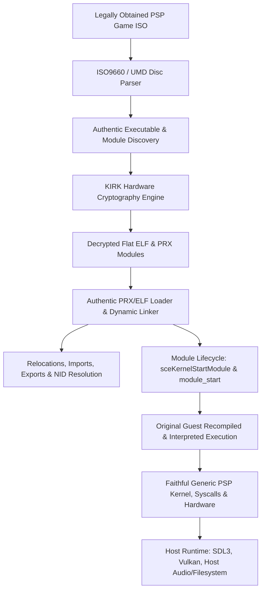

# LLE Fidelity Architecture: Authentic Guest Execution Doctrine

## 1. Architectural Doctrine & Guiding Principles

The fundamental engineering priority for Nakagawa Recomp is:

$$\text{CORRECTNESS / FIDELITY} > \text{ARCHITECTURAL CLEANLINESS} > \text{GENERALITY} > \text{SHORT-TERM EASE}$$

### 1.1 The Primacy of Original Guest Execution
Nakagawa Recomp is not a high-level API emulator that mimics game behavior by rewriting game systems in host C or C++. It is an **Ahead-of-Time (AOT) and fail-closed interpreter recompilation platform** whose core mission is to execute genuine PSP machine code faithfully on modern host hardware.

Every component of the guest title—including executables, dynamic PRX libraries, vendor middleware, and math routines—should execute as compiled MIPS/Allegrex instructions wherever technically feasible.

### 1.2 The Role of HLE
High-Level Emulation (HLE) is **not** an architectural goal; it is a pragmatic boundary condition:
- HLE is strictly restricted to generic PSP OS/kernel services and physical hardware boundaries that inherently require host implementation (e.g., thread scheduling via host fibers/threads, Vulkan command submission for the GE rasterizer, SDL3 audio stream buffering, and host filesystem I/O).
- HLE must never be used as a shortcut to bypass difficult guest modules, skip setup steps, or avoid reverse-engineering complex guest state machines.
- **Title-specific replacements, patches, bypasses, approximate host substitutes, and middleware reimpletations are last resorts.**

---

## 2. The Authentic Execution Pipeline

The target end-to-end execution pipeline from raw user disc to running game is:

Under this architecture, Nakagawa does not cherry-pick convenient portions of the title and substitute the rest with native C code. The entire software stack authored by the game developers runs as intended on the virtualized PSP platform.

---

## 3. Subsystem Investigation: The True LLE Path

### 3.1 Retail EBOOT and PRX Cryptography

#### Container Formats Encountered
PSP UMD disc images contain executables in two primary container formats:
1. **`~PSP` Header (Encrypted / Compressed PRX):**
   - Standard PRX container beginning with magic `~PSP` (`0x7E 0x50 0x53 0x50`).
   - Contains load segment metadata, BSS sizes (offset `0x38`), total memory footprint, and embedded Kirk cryptographic headers.
2. **`~SCE` Header (SCE Signed Executable Container):**
   - Wrapped container beginning with magic `~SCE` (`0x7E 0x53 0x43 0x45`).
   - Contains ECDSA Curve-160 signature blocks, Kirk encryption tags (e.g., `0x08000000`, `0x08D40000`), AES-128-CBC initialization vectors, and encrypted payload extents.

#### KIRK Cryptographic Engine Requirements
To accept untouched, encrypted `EBOOT.BIN` and PRX files directly from a user's ISO, Nakagawa requires an authentic implementation of the PSP's KIRK security processor:
- **`KIRK_CMD_DECRYPT_PRX` (CMD 1):** Validates the header checksum, performs AES-128-CBC decryption using the tag-indexed hardware key, and validates the SHA-1 hash over the decrypted output.
- **`KIRK_CMD_ECDSA_VERIFY` (CMD 2 / CMD 3):** Validates the ECDSA signature over the executable header.
- **`KIRK_CMD_AES_CBC_DECRYPT` (CMD 7):** Standard AES-128-CBC decryption.

#### Provenance and Key Material Discipline
- **Legal Reality:** The mathematical algorithms of KIRK (AES-128-CBC, SHA-1, ECDSA Curve-160, pseudo-random generators) are clean-room, uncopyrightable mathematical operations. Open-source implementations exist across the emulation ecosystem (`libkirk`, ProCFW `kirk.c`, PPSSPP `Kirk.cpp`, JPCSP `CryptoEngine.java`).
- **Cryptographic Keys:** Proprietary Sony master keys (Keys `0x01` through `0x7F`) cannot be stored in the public Nakagawa repository (`PUBLIC_EXPORT.json`, `KEY_HISTORY_SCRUB.md`).
- **Architectural Solution:**
  1. Nakagawa implements the generic KIRK cryptographic engine in pure, clean-room C.
  2. The key store is completely externalized: keys are loaded from an external, user-supplied keyring file (`%LOCALAPPDATA%/nakagawa/keys/kirk_keys.bin`) or derived locally on the user's machine during setup.
  3. Decryption occurs entirely on the user's local machine; no decrypted retail binaries or proprietary keys are ever distributed by the project.

---

### 3.2 Dynamic PRX and Module Loading Machinery

#### Module Loading Completeness Audit
Genuine PSP games do not execute in a flat, monolithic binary space. They dynamically load and unload PRX modules using `sceKernelLoadModule` and `sceKernelStartModule`.

To execute original middleware (`libfont.prx`, `scePsmf_library.prx`, `scePsmfP_library.prx`), Nakagawa's runtime module machinery must provide:
1. **Dynamic Relocation Application:**
   - Support for both Type-A (`SHT_PRX_RELOC = 0x700000A0`) and packed Type-B (`SHT_PRX_RELOC_PACKED = 0x700000A1`) relocations.
   - Exact application of MIPS relocation types: `R_MIPS_16`, `R_MIPS_32`, `R_MIPS_26`, `R_MIPS_HI16`, `R_MIPS_LO16`, and `R_MIPS_GPREL16`.
2. **Export and Import Table Resolution:**
   - Accurate NID matching between exporting libraries and importing clients.
   - Dynamic binding of stub jump tables (`stub_table`) to concrete guest addresses or HLE dispatch thunks.
3. **Module Lifecycle Execution:**
   - Invocation of `module_start` in a dedicated thread context with proper `argc` and `argv` pointer blocks.
   - Return value propagation and module status tracking (`SCE_KERNEL_ERROR_ALREADY_STARTED`, etc.).

#### Why Guest PRXs Previously Failed
In early Nakagawa development, executing `module_start` for `libfont.prx` and `psmf.prx` resulted in hangs on `sceKernelWaitSema`. This was an artifact of incomplete kernel synchronization emulation, not an inherent impossibility of running the code. Rather than fixing the underlying kernel semaphore and thread scheduling contracts, previous passes short-circuited `module_start`, wrote hardcoded compatibility flags into guest memory, and provided wholesale HLE stubs. Under the LLE doctrine, this short-circuit is recognized as technical debt to be systematically eliminated.

---

### 3.3 Font System: PGF Fidelity vs. TTF Approximation

#### The Reality of `libfont.prx` and `sceFont`
- `libfont.prx` is genuine PSP userland middleware developed by Sony. It implements the `sceFont` API (`sceFontNewLib`, `sceFontOpen`, `sceFontGetCharGlyphImage_Clip`, etc.).
- When executing as guest code, `libfont.prx` parses Sony PGF (PlayStation Glyph Format) font containers, computes glyph layout metrics, processes kerning pairs, and rasterizes glyph alpha bitmaps using the PSP's Allegrex CPU and VFPU.

#### Why Wholesale TTF / `stb_truetype` HLE Was Rejected
1. **Glyph Metric Mismatches:** TrueType fonts (TTF/OTF) use different vector outline models, hinting instructions, and metric scalers than Sony's PGF rasterizer. Replacing PGF with standard TTF causes subtle differences in horizontal advances, character widths, and line heights.
2. **Text Clipping and HUD Breakage:** In games with fixed UI text boxes (such as tournament brackets, player stat cards, and scoreboards in *Hot Shots Tennis*), metric differences can cause text strings to wrap prematurely, truncate, or overflow their allocated background boxes.
3. **Baseline and Shadow Misalignments:** PSP games frequently render two font passes (a dark shadow offset by $(+1, +1)$ or $(+2, +2)$ pixels behind the main text). Inaccurate glyph rasterization leads to visible fringing and visual bugs.
4. **Architectural Deviation:** Bypassing `libfont.prx` throws away thousands of lines of authentic PSP code in exchange for a host substitute.

#### The Authentic PGF Path and Firmware Honesty
- **ISO vs. Firmware Reality:** The PGF font files (`jpn0.pgf`, `ltn0.pgf`, etc.) are located in the PSP's internal `flash0:/font/` filesystem partition, **not** on the game UMD disc.
- **Honest Prerequisite Discipline:** We do not sacrifice fidelity merely to claim "Program + ISO". If authentic rendering requires the genuine Sony PGF font, we state clearly:
  $$\text{Nakagawa} + \text{Game ISO} + \text{User-Supplied Firmware Font (flash0)}$$
- A non-authentic TTF replacement mode may exist solely as an optional, clearly labeled developer fallback, but it is **not** the architectural baseline.

---

### 3.4 PSMF Video Subsystem: Downward Dependency Boundary

#### Original Middleware Execution
PSMF (PlayStation Stream Media Format) multiplexes AVC/H.264 video and ATRAC3plus audio streams.
- The player middleware (`scePsmf_library.prx`, `scePsmfP_library.prx`) manages presentation timestamps, stream demultiplexing, and ring buffer flow control.
- Under LLE doctrine, these PRX modules must execute as original guest code.

#### Defining the Lowest-Level Hardware Boundary
Executing guest PSMF middleware does not require software-emulating an H.264 video decoder on the MIPS CPU.
1. The guest PSMF modules call downward into low-level hardware abstraction libraries: `sceMpeg`, `sceVideocodec`, and `sceAudiocodec`.
2. On physical hardware, `sceMpeg` delegates bitstream decoding to the PSP's dedicated Media Engine (ME) and AVC hardware decoder.
3. Therefore, the **correct, natural HLE boundary** is at the `sceMpeg` / `sceVideocodec` interface:
   - Guest PSMF middleware handles demuxing, buffering, and state transitions.
   - Nakagawa's runtime intercepts raw compressed NAL packets at the `sceMpeg` boundary and dispatches them to host hardware decoders (Vulkan Video, DXVA2/Media Foundation, or ffmpeg/libavcodec).
   - Audio packets (ATRAC3plus) are decoded via clean-room host audio libraries and fed back into guest ring buffers.

---

### 3.5 Filesystem and Asset Storage: Guest Transparency

#### Preserving PSP-Visible Filesystem Invariants
Guest software is intimately aware of filesystem semantics. Any storage optimization (such as direct archive mounting) must remain strictly below the PSP kernel boundary.

The guest MIPS program must observe:
- **Canonical Paths:** Exact access through `disc0:/` or `host0:/` without virtual path remapping.
- **Exact File Metadata:** Identical file sizes, directory enumeration order, and file timestamps.
- **Strict Error Codes:** Returning genuine PSP error numbers (e.g., `SCE_ERROR_ERRNO_FILE_NOT_FOUND = 0x80010002`).
- **Seek and Read Semantics:** Byte-accurate seek positions, EOF flags, and partial-read return values.

#### Transparent Archive VFS
Directly reading assets from the `data.xb` container without extracting 56,672 files to disk is fully compatible with LLE **if and only if** it is implemented as a transparent block driver inside `src/rt/iso.c`. The guest continues calling `sceIoOpen("disc0:/PSP_GAME/USRDIR/data.xb", ...)` or standard file APIs, completely unaware that the host is streaming sectors directly from the container.

---

## 4. Multi-Title Scalability Principles

Title profiles must describe titles, **not** implement compatibility workarounds:
- **Valid Profile Data:** Primary disc ID, disc revision, executable paths (`SYSDIR/EBOOT.BIN`), required PRX module lists, known entry points, expected data hashes, and save directory names. Regional releases are treated as distinct binary targets unless proven identical.
- **Prohibited Profile Fields:** Fields resembling `patch_x`, `fake_return_y`, `skip_module_start`, or `replace_lib_z`.
- **Architectural Rule:** When a new game fails to run on Nakagawa, the failure must be treated as a bug in the generic CPU, compiler, kernel, or hardware emulation. Fixing the bug improves the platform for all PSP titles rather than creating a fragmented collection of game-specific hacks.
