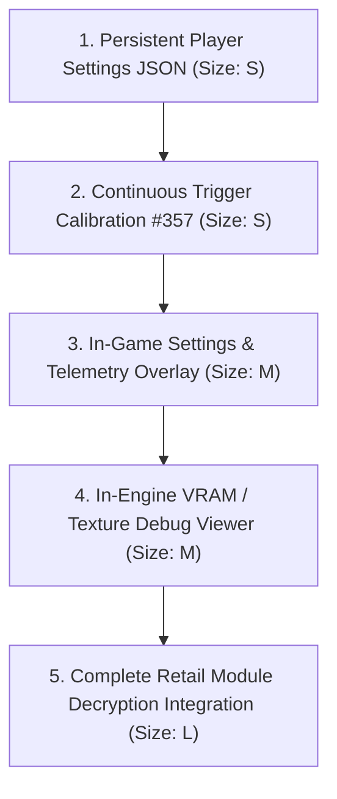
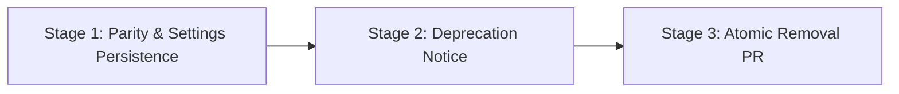

# Localhost Web Dashboard Retirement Plan & Parity Audit

> **Status: PLAN — proposed retirement plan.** The localhost web dashboard (`interface/`, a Next.js application) remains in the repository while native parity is completed. This document specifies the comprehensive capability inventory, native equivalent classifications, remaining work list, artifacts to be deleted at retirement, and the phased retirement sequence.
>
> References to future native features below are planned targets, not current capability. No code removal occurs until Phase 1 parity requirements pass acceptance.

---

## 1. Executive Summary

Nakagawa Recomp originally introduced a localhost web prototype under [`interface/`](../interface/) (branded as *Nakagawa Studio*) to provide developers with rapid visibility into recompiler internals, task execution, and diagnostics. While valuable during early bringup, running a browser-based dashboard imposes significant drawbacks:

1. **Severe Friction for Common Users**: Requires Node.js 24+, npm 11+, and running `npm run dev` from a terminal;
2. **Sandbox Impasse**: The browser cannot directly read or write local disc images, stage files in `%LOCALAPPDATA%`, or invoke native OS file pickers without external helper processes;
3. **Disjoint Experience**: Game rendering runs in a native Vulkan window (`hst.exe` or `display-smoke`), completely separate from the browser controls;
4. **Maintenance & Compliance Burden**: 708 transitive npm dependencies (`interface/package-lock.json`), complex CI checks (`dashboard` job in `ci.yml`), Dependabot noise, and extensive license/notice/SBOM obligations (#421).

With the native desktop player (`src/player/`, SDL3) and the headless command-line interface (`tools/nk_cli.py`) now functional, the project will retire `interface/` once essential parity is established.

---

## 2. Complete Web Dashboard Capability Inventory & Parity Audit

Every user-visible feature and backend route in `interface/src` is evaluated below against its native desktop counterpart (`src/player/*`, `src/core/*`) or headless command-line tool (`tools/nk_cli.py`, `tools/nk_doctor.py`, `tools/mem_debug.py`).

### Classification Schema

- `NATIVE_EQUIVALENT_EXISTS`: A complete, functional native equivalent is implemented in the repository (cited with file/function).
- `NATIVE_PARTIAL`: A native equivalent exists but lacks specific features or persistence needed for full parity.
- `MISSING`: A needed feature with no native equivalent implemented yet.
- `NOT_NEEDED`: A developer-only, superseded, or prototype-specific artifact that is intentionally not carried into the consumer recompiler.

---

### Category A: Core Player & Library Lifecycle

| Capability | Web Source Component | Backend / Tools Called | Native Equivalent | Classification | Notes & Gaps |
| :--- | :--- | :--- | :--- | :--- | :--- |
| **Title Library & Navigation** | `components/studio/iso-loader.tsx` | In-memory only; no multi-title library | `src/player/player_state.c` (`PLAYER_VIEW_READY_LIBRARY`), `src/player/ui_renderer.c`, `src/core/nk_library.c` | `NATIVE_EQUIVALENT_EXISTS` | Native player has persistent multi-title library (`library.json`), card navigation via gamepad/keyboard/mouse, and moved-ISO detection. |
| **Native File Picker** | `components/studio/iso-loader.tsx` | Browser HTML file input (sandbox constrained) | `src/player/main.c` (`SDL_ShowOpenFileDialog`) | `NATIVE_EQUIVALENT_EXISTS` | Platform-native file dialog invoked directly from SDL3 event loop without terminal prompts. |
| **Drag & Drop ISO** | `components/studio/iso-loader.tsx` | HTML5 drag-and-drop | `src/player/main.c` (`SDL_EVENT_DROP_FILE`) | `NATIVE_EQUIVALENT_EXISTS` | Dropping an ISO into the native player window triggers immediate inspection. |
| **Disc Identification & Parsing** | `components/studio/iso-loader.tsx`, `lib/recompiler/iso.ts` | Client-side JS ISO9660 PVD/SFO parser | `src/player/iso_reader.c` (`nk_iso_inspect`), `src/core/nk_iso.c`, `tools/nk_cli.py` (`inspect`) | `NATIVE_EQUIVALENT_EXISTS` | Pure C ISO9660 PVD and `PARAM.SFO` parser extracting Disc ID, Title, and Region. |
| **ISO Directory Tree Exploration** | `components/studio/iso-file-tree.tsx` | Client-side directory tree traversal | `tools/nk_cli.py` (`inspect` subcommand), `tools/nk_core/iso_inspect.py` (`list_iso_directory`) | `NATIVE_EQUIVALENT_EXISTS` | Available headlessly via `tools/nk_cli.py inspect <iso>`; not needed in consumer GUI. |
| **Game Asset Staging & Extraction** | `components/studio/build-panel.tsx` | `lib/recompiler/manager-process.ts` (`nk_manager.ps1 -Action BuildFull`) | `src/player/setup_staging.c` (`setup_staging_worker`), `src/core/nk_xb.c`, `tools/nk_cli.py` (`prepare`) | `NATIVE_PARTIAL` | Native wizard stages `EBOOT.BIN` and unpacks `xbdata` without external tools; KIRK module decryption remains in development. |
| **Runtime Process Launch** | `components/studio/build-panel.tsx`, `app/api/recompiler/manager/route.ts` | `lib/recompiler/manager-process.ts` (`nk_manager.ps1 -Action Run`) | `src/core/nk_launch.c` (`nk_launch_prepare_session`, `nk_launch_start`), `src/player/player_state.c` | `NATIVE_EQUIVALENT_EXISTS` | Spawns recompiled runtime directly via platform process API (`CreateProcessW`/`execve`) passing typed session environments (`PSP_ISO`, `SR_DATAROOT`, `SR_MEMSTICK`). |
| **Process Cancellation & Tracking** | `components/studio/build-panel.tsx`, `app/api/recompiler/manager/route.ts` | `lib/recompiler/manager-process.ts` (`taskkill.exe`) | `src/core/nk_launch.c` (`nk_launch_terminate`, `nk_launch_poll`) | `NATIVE_EQUIVALENT_EXISTS` | Native child process lifecycle is tracked and clean process termination is supported. |

---

### Category B: Configuration, Controls & Settings

| Capability | Web Source Component | Backend / Tools Called | Native Equivalent | Classification | Notes & Gaps |
| :--- | :--- | :--- | :--- | :--- | :--- |
| **Graphics & Display Settings** | `components/studio/graphics-panel.tsx`, `app/api/recompiler/config/route.ts` | Prisma SQLite (`dev.db`), `defaults.ts` | `src/player/player_state.c` (`PLAYER_VIEW_SETTINGS`), `src/player/ui_renderer.c` | `NATIVE_PARTIAL` | Resolution scale, FPS limit, VSync, fullscreen, reduce-motion, and volume exist in-memory; disk persistence to a JSON config file is missing. |
| **Controller Remapping & Calibration** | `components/studio/controllers-panel.tsx`, `hooks/use-gamepads.ts` | Browser Gamepad API | `src/player/input_settings.c`, `src/player/player_state.c` (`VIEW_CONTROLLER_SETTINGS`), `src/core/nk_input_profile.c` | `NATIVE_EQUIVALENT_EXISTS` | Native SDL3 screen rebinding 14 digital controls + analog stick, live input monitor, deadzone/trigger steppers, conflict detection, and atomic persistence (`<config>/input_profile.json`). Resting/extreme calibration in progress (#357). |
| **Multi-Profile Management & Diffs** | `components/studio/profile-switcher.tsx`, `components/studio/config-diff.tsx`, `app/api/recompiler/profiles/` | Prisma SQLite (`dev.db`), `profile-store.ts` | None | `NOT_NEEDED` | Complex profile switcher and JSON diffs were developer prototype artifacts. End-user recompiler relies on persistent configuration files. |
| **Configuration Sharing & ZIP Export** | `components/studio/share-dialog.tsx`, `app/api/recompiler/telemetry/export/route.ts` | `lib/recompiler/zip.ts` packing `dev.db` and reports | None | `NOT_NEEDED` | Web-specific export packaging local SQLite databases. |
| **Game Patches / Cheats Toggles** | `components/studio/patches-panel.tsx` | Web config toggles | Title manifests (`assets/titles/`) and CLI runtime flags | `NOT_NEEDED` | Patches are authored and loaded as title manifest enhancements or CLI arguments; a standalone web patch editor is obsolete. |
| **Performance Execution Flags** | `components/studio/performance-panel.tsx` | Web config flags (fast memory, block linking) | Runtime CLI flags (`--jit`, `--interp`, `--lle-cpu`) | `NOT_NEEDED` | Developer execution flags belong on the CLI or title profile, not in a consumer settings menu. |

---

### Category C: Diagnostics, Logs & Troubleshooting

| Capability | Web Source Component | Backend / Tools Called | Native Equivalent | Classification | Notes & Gaps |
| :--- | :--- | :--- | :--- | :--- | :--- |
| **Workspace & Toolchain Diagnostics** | `components/studio/troubleshooting-panel.tsx`, `app/api/recompiler/doctor/route.ts` | `tools/nk_doctor.py` via `lib/recompiler/doctor.ts` | `tools/nk_doctor.py` (CLI), `src/core/nk_launch.c` (preflight validation) | `NATIVE_EQUIVALENT_EXISTS` | `tools/nk_doctor.py` provides the canonical diagnostic report; `nk_launch.c` validates prerequisite binaries and paths prior to launch. |
| **Live Log Streaming** | `components/studio/build-panel.tsx`, `app/api/recompiler/log/route.ts` | Incremental polling of `logs/stderr_run*.log` | Terminal stdout/stderr, `logs/native_player.log` | `NOT_NEEDED` | Web log ring buffer worked around browser sandboxing; native player and CLI output directly to files and standard streams. |
| **Boot Event Milestone Verification** | `app/api/recompiler/boot/route.ts` | Parses `BOOT_EVENT` from logs (`window_ready`, `display_flip`, `first_frame`) | `display-smoke-run` / `display-smoke-player` Makefile targets | `NATIVE_EQUIVALENT_EXISTS` | Presentation milestones are verified headlessly in CI and via the native player smoke test. |
| **Known Limitations & Issues Viewer** | `components/studio/limitations-panel.tsx`, `app/api/recompiler/issues/route.ts` | Reads `ISSUES.md` from disk | Maintained documentation (`ISSUES.md`, `assets/issue_routing.json`) | `NOT_NEEDED` | Reading repository Markdown files inside a web iframe is superseded by Git and documentation indexes. |

---

### Category D: Developer Tools, Profiling & Deep Inspection

| Capability | Web Source Component | Backend / Tools Called | Native Equivalent | Classification | Notes & Gaps |
| :--- | :--- | :--- | :--- | :--- | :--- |
| **Memory & Register Debug Console** | `components/studio/execution-console.tsx`, `app/api/recompiler/debug/console/route.ts` | `tools/mem_debug.py` | `tools/mem_debug.py` (CLI) | `NATIVE_EQUIVALENT_EXISTS` | Interactive CLI debug tool callable directly from the terminal or gdb. |
| **Memory Watchpoints Management** | `app/api/recompiler/watchpoints/route.ts` | Prisma DB -> `watchpoints.json` -> `src/rt/watchpoints_file.c` | JSON configuration file, `watchpoints-file-selftest` | `NOT_NEEDED` | Watchpoints are developer test instrumentation configured via CLI/JSON, not requiring a web GUI. |
| **VRAM & Texture Viewer** | `components/studio/vram-viewer.tsx` | Debug console route / VRAM dump | None (Planned in-game overlay) | `MISSING` | Inspecting live VRAM buffers and GE textures currently has no native viewer; planned for future in-game debug overlay or RenderDoc integration. |
| **Performance Profiler & Hotspots** | `components/studio/profiler-panel.tsx`, `app/api/recompiler/telemetry/profiler/route.ts` | Parses `--- PERF_PROFILE ---` from logs, SQLite | `tools/generate_benchmarks.py`, `SR_PROFILE=1` | `NATIVE_PARTIAL` | Benchmark reports exist headlessly; live in-game FPS/frame-time overlay is not yet implemented. |
| **Visual Regression Comparator** | `components/studio/visual-regression-panel.tsx`, `app/api/recompiler/visual-regression/` | `tools/ppmdiff.py`, `visual_regression_report.json`, sharp | `tools/ppmdiff.py` (CLI / CI gate) | `NATIVE_EQUIVALENT_EXISTS` | Golden frame comparison and heatmap calculation are handled headlessly by `tools/ppmdiff.py`. |
| **Fuzz Lab & Microtest Generator** | `components/studio/test-lab-panel.tsx`, `app/api/recompiler/tests/` | `tools/gen_microtest.py`, `tools/fuzz_vfpu.py`, `nk_manager.ps1 -Action Fuzz` | `tools/gen_microtest.py`, `Makefile` (`vfpu-fuzz`, `microtest`) | `NATIVE_EQUIVALENT_EXISTS` | Developer fuzzing and test generation operate via CLI scripts and Makefile targets. |
| **NID / HLE Syscall Audit** | `components/studio/nid-audit-panel.tsx`, `app/api/recompiler/debug/nid-audit/route.ts` | `tools/hle_manifest.py`, parses `imports.toml` | `tools/hle_manifest.py`, `tools/import_audit.py` | `NATIVE_EQUIVALENT_EXISTS` | Syscall and NID coverage audits are automated in tools and CI. |
| **Recompiler Internals (Chunks/Spans)** | `components/studio/internals-panel.tsx` | Parses recompiler stdout / chunk map | `tools/codegen_summary.py`, `tools/benchmark_codegen_chunks.py` | `NOT_NEEDED` | Developer inspection superseded by CLI summary tools and build artifacts. |
| **Extracted Asset Browser** | `components/studio/assets-panel.tsx`, `app/api/recompiler/assets/route.ts` | Traverses `xbdata_extracted`, `inventory_map.json` | `src/player/setup_staging.c` (census metadata), `src/player/ui_renderer.c` | `NATIVE_PARTIAL` | Asset census (audio, visual, layout counts) is displayed on library cards; individual file tree viewing is a developer feature. |
| **Porting & Compatibility Tracker** | `components/studio/progress-panel.tsx`, `components/studio/porting-panel.tsx` | `tools/progress_tracker.py`, `progress.json` | `tools/progress_tracker.py` (CLI), `docs/PORTING.md` | `NATIVE_EQUIVALENT_EXISTS` | Progress tracking is maintained by `tools/progress_tracker.py`. |

---

## 3. Ordered Work List for Native Parity

To enable full retirement of `interface/`, the `MISSING` and `NATIVE_PARTIAL` items must be addressed according to priority.

### Work Items

1. **Persistent Player Settings File Serialization**
   - **Status**: `NATIVE_PARTIAL`
   - **Rough Size**: `S` (Small, 1–2 days)
   - **Description**: Currently `src/player/player_state.c` stores `PlayerSettings` in-memory. Implement atomic JSON serialization to `%LOCALAPPDATA%/Nakagawa/config/player_settings.json` (on Windows) and `$XDG_CONFIG_HOME/nakagawa-recomp/player_settings.json` (on Linux), matching the atomic pattern used in `src/core/nk_input_profile.c`.
   - **Requirements**: Save and reload resolution scale, FPS limit, VSync, fullscreen toggle, motion toggle, and volume.

2. **Continuous Trigger Calibration Completion (#357)**
   - **Status**: `NATIVE_PARTIAL`
   - **Rough Size**: `S` (Small, 1–2 days)
   - **Description**: Complete the resting and extreme value calibration for analog triggers in `src/player/input_settings.c` and `ui_renderer.c` as tracked under issue #357.

3. **In-Engine Pause Overlay & Telemetry HUD**
   - **Status**: `MISSING` / `NATIVE_PARTIAL`
   - **Rough Size**: `M` (Medium, 3–5 days)
   - **Description**: Embed an in-engine overlay hook into the SDL3 Vulkan swapchain (`src/rt/gpu_sdl3vk/`) triggered via keyboard (`F1` / `Escape`) or Gamepad (`Guide` / `Home`).
   - **Requirements**: Display live FPS, frame times, VBlank rate, and basic audio/graphics toggles without leaving the running game window.

4. **In-Engine VRAM & Texture Debug Inspector**
   - **Status**: `MISSING`
   - **Rough Size**: `M` (Medium, 3–5 days)
   - **Description**: Add a developer diagnostic toggle to the in-engine overlay or a headless dump utility allowing inspection of active GE textures, framebuffer targets, and depth buffers.

5. **Complete Retail Preparation & Module Decryption Pipeline**
   - **Status**: `NATIVE_PARTIAL`
   - **Rough Size**: `L` (Large, cross-cutting core campaign)
   - **Description**: Connect the source-owned KIRK decryption engine to allow lawful extraction of encrypted retail `~PSP` containers into decrypted ELF executables, enabling arbitrary commercial ISO bringup without external pre-decrypted dumps.

---

## 4. Deletion Inventory at Retirement

Upon execution of the retirement PR, the following files, configurations, CI jobs, notices, and provenance entries will be permanently removed from the repository:

### 4.1 Source & Build Files

- **`interface/` directory (entire tree)**:
  - `interface/src/` (all pages, components, hooks, API routes, and TypeScript libraries)
  - `interface/package.json` and `interface/package-lock.json`
  - `interface/prisma/` (`schema.prisma`, `dev.db`, `migrations`)
  - `interface/public/` (`logo.svg`, `robots.txt`)
  - `interface/scripts/` (`prepare-standalone.mjs`, `start-standalone.mjs`)
  - `interface/next.config.ts`, `interface/tailwind.config.ts`, `interface/tsconfig.json`, `interface/eslint.config.mjs`

### 4.2 CI Workflows & Automation

- **`.github/workflows/ci.yml`**:
  - Remove job `dashboard:` (`name: Dashboard checks`, lines 418–517)
  - Remove dashboard condition from `needs.classify.outputs.run_dashboard == 'true'`
- **`tools/ci_paths.py`**:
  - Remove `_is_dashboard()` path matcher and `dashboard` / `run_dashboard` matrix outputs
- **`.github/dependabot.yml`**:
  - Remove `package-ecosystem: npm` block targeting `/interface` (lines 47–66)
- **OSV-Scanner & Dependency Review**:
  - Automatically relieved of scanning 708 npm packages

### 4.3 Third-Party Licenses, SBOM & Notices

- **`THIRD_PARTY_LICENSES/SHADCN_UI.txt`**: Deleted (shadcn/ui MIT license notice)
- **`NOTICE.md`**:
  - Remove `shadcn/ui` entry from third-party list (lines 29–30)
  - Remove section `### Dashboard dependency boundary` (lines 35–45)
- **Issue #421 Compliance Relief**:
  - Completely eliminates the requirement to generate license attribution bundles and SBOMs for Next.js standalone runtime and npm dependencies (Apache-2.0, LGPL-3.0 sharp, MPL-2.0, CC-BY-4.0, EPL-2.0).

### 4.4 Provenance Ledger & Profile Records

- **`assets/public_source_profile.json`**:
  - Drop all `interface/*` paths from `include_paths`
- **`assets/public_provenance_ledger.json`**:
  - Remove all path-hashed entries under `interface/*` via `mingw32-make provenance-refresh`

### 4.5 Documentation Updates

- **`docs/WEB_UI_MIGRATION.md`**: Marked as `HISTORICAL` / superseded
- **`docs/README.md`**: Update indexes to reflect retirement
- **`README.md`**, **`docs/ARCHITECTURE.md`**, **`docs/CI.md`**, **`docs/SETUP.md`**: Remove references to Node.js, Next.js, and running `npm run dev`

---

## 5. Execution Sequence

The retirement will proceed through three explicit stages:

1. **Stage 1: Parity & Settings Persistence (In Progress)**
   - Land persistent player settings serialization to `<config>/player_settings.json`.
   - Verify all regression gates in `docs/NATIVE_UI_REGRESSION_MATRIX.md` continue to pass.
   - Confirm command-line developer workflows (`tools/nk_cli.py`, `tools/nk_doctor.py`, `tools/mem_debug.py`) cover necessary developer tasks.

2. **Stage 2: Deprecation Notice**
   - Place a clear deprecation banner in `interface/README.md` and `interface/src/app/page.tsx` directing users to the native player (`mingw32-make player`).
   - Add a runtime console notice on `npm run dev` signaling upcoming removal.

3. **Stage 3: Atomic Removal PR**
   - Delete `interface/` and `THIRD_PARTY_LICENSES/SHADCN_UI.txt`.
   - Update `.github/workflows/ci.yml`, `tools/ci_paths.py`, and `.github/dependabot.yml`.
   - Update `NOTICE.md`, `assets/public_source_profile.json`, and regenerate `assets/public_provenance_ledger.json`.
   - Update documentation indexes in `docs/README.md` and related architecture guides.
